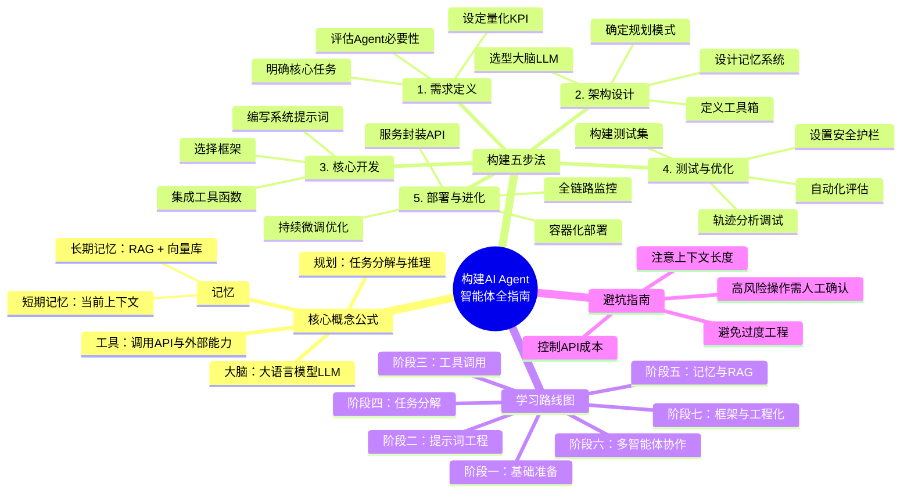

# DeepSeek 对话记录

> 分享链接: https://chat.deepseek.com/share/medebffsb5ecaetp6s
> 总轮数: 18 轮

---

## 第 1 轮对话

### 👤 用户

我想要自己构建一个agent智能体，具体该怎么做，请引导我

### 🤖 DeepSeek

构建一个AI智能体（Agent）是一个系统工程，可以把它想象成创造一个拥有“大脑”并能自主行动的“数字员工”[reference:0][reference:1]。

下面是一份从0到1的完整引导指南。

### 核心概念：Agent = LLM + 规划 + 记忆 + 工具

一个成熟的智能体，其本质可以概括为一个公式[reference:2][reference:3]：

> **Agent = 大语言模型 (LLM) + 规划 (Planning) + 记忆 (Memory) + 工具使用 (Tool Use)**

*   **大脑 (LLM)**：负责理解和推理的核心[reference:4]。
*   **规划 (Planning)**：将复杂目标拆解为可执行的子任务[reference:5][reference:6]。
*   **记忆 (Memory)**：分为维持当前对话的**短期记忆**和存储历史信息的**长期记忆**[reference:7][reference:8]。
*   **工具 (Tool Use)**：赋予Agent调用外部API（如查询天气、发送邮件）的能力[reference:9][reference:10]。

### 构建智能体的五个核心步骤

#### 1. 需求定义与场景明确
在动手之前，先想清楚要解决什么问题[reference:11][reference:12]。

*   **明确核心任务**：是做客服、代码审查，还是个性化的学习助手？[reference:13]
*   **评估必要性**：简单的固定脚本或提示词就能解决的任务，无需引入复杂的Agent[reference:14][reference:15]。
*   **设定成功指标**：定义量化的KPI，如任务完成率、响应时间等[reference:16]。

#### 2. 系统架构设计
为你的“数字员工”设计大脑和四肢。

*   **选择大脑 (LLM)**：根据推理能力、成本和上下文长度选择，如GPT-4o、Claude 3.5或开源的Llama 3等[reference:17][reference:18]。
*   **设计记忆系统**：
    *   **短期记忆**：维护当前会话的上下文[reference:19]。
    *   **长期记忆**：通过RAG（检索增强生成）系统，结合向量数据库（如Milvus, Pinecone）来存储和检索知识[reference:20][reference:21]。
*   **确定规划模式**：选择推理框架，如ReAct（推理+行动）模式[reference:22]。
*   **定义工具箱**：列出Agent需要调用的外部能力，如搜索、数据库查询等[reference:23]。

#### 3. 核心开发与实现
这是编码实现阶段，通常借助框架进行[reference:24]。

*   **选择开发框架**：
    *   **LangChain / LangGraph**：功能全面的主流框架，LangGraph特别适合复杂的图结构工作流[reference:25][reference:26]。
    *   **AutoGen / CrewAI**：专注于多智能体协作[reference:27][reference:28]。
    *   **LlamaIndex**：侧重于数据检索和RAG应用[reference:29]。
    *   **低代码平台**：如Coze、Dify，适合快速验证想法或非专业开发者[reference:30][reference:31]。
*   **编写系统提示词**：赋予Agent角色设定、行为准则和输出格式[reference:32]。
*   **集成工具**：将外部API封装成LLM可以理解的函数（Function Call），让Agent能自主调用[reference:33][reference:34]。

#### 4. 测试、评估与优化
Agent的测试比传统软件更复杂，需要关注其推理和行动轨迹[reference:35]。

*   **构建测试数据集**：准备典型问题和边缘案例[reference:36]。
*   **轨迹分析**：使用LangSmith等工具拆解Agent的每一步“思考-行动-观察”，定位问题[reference:37]。
*   **自动化评估**：用更强大的模型（LLM-as-a-Judge）对Agent的回答质量进行打分[reference:38]。
*   **安全护栏**：设置输入/输出过滤，防止恶意指令和敏感信息泄露[reference:39]。对高风险操作（如删除数据）加入**人工确认环节**[reference:40][reference:41]。

#### 5. 部署、监控与持续进化
将Agent服务化，并让它在上线后不断学习[reference:42]。

*   **服务封装**：使用FastAPI等将Agent逻辑封装为API服务[reference:43]。
*   **基础设施**：通过Docker容器化部署，并设置限流、熔断等机制以防成本失控[reference:44][reference:45]。
*   **全链路监控**：记录每次调用的耗时、成本和成功率[reference:46]。
*   **持续优化**：基于用户反馈和数据，通过微调（Fine-tuning）等方式让Agent越用越聪明[reference:47]。

### 学习路线与资源推荐

对于初学者，可以参考以下分阶段的学习路径[!reference:48]：

1.  **基础准备**：掌握Python编程、API使用和Git等基础工具[!reference:49]。
2.  **提示词工程**：系统学习Prompt结构、思维链（CoT）等设计模式[!reference:50]。
3.  **工具调用**：学习如何封装API为工具，并让模型调用，可做一个聚合天气、汇率查询的小项目[!reference:51]。
4.  **任务分解**：让Agent能自主进行多步推理和工具调用[!reference:52]。
5.  **记忆与知识库**：学习RAG，打造一个个人知识问答Agent[!reference:53]。
6.  **多智能体协作**：尝试构建多角色协作的系统[!reference:54]。
7.  **框架实践与工程化**：使用LangChain等主流框架，将Agent产品化[!reference:55]。

市面上也有许多优质书籍和教程可供参考[reference:56][reference:57][reference:58]。

### 常见陷阱与最佳实践

*   **避免过度工程**：并非所有问题都需要Agent来解决[reference:59]。
*   **注意上下文长度**：长任务可能导致上下文过载，需引入记忆压缩机制[reference:60]。
*   **成本控制**：设置单次任务的Token消耗上限，防止逻辑死循环烧光API额度[reference:61]。
*   **安全第一**：永远对高风险操作设置人工确认的“安全闸门”[reference:62][reference:63]。

**总结一下**，构建Agent的关键是**从业务需求出发，选择合适的架构和工具，并建立完善的测试、安全与监控体系**。

如果你是初学者，建议先从**Coze或Dify这类低代码平台**入手，快速搭建一个原型[reference:64]；如果你是有经验的开发者，则可以深入研究**LangChain或AutoGen**，构建更定制化的解决方案[reference:65]。

现在，你心中有没有初步想构建的Agent场景呢？如果有具体方向（比如客服、个人助理或代码助手），可以告诉我，我帮你进一步细化技术选型和实现路径。

---

## 第 2 轮对话

### 👤 用户

可以帮我整理成思维导图

### 🤖 DeepSeek

没问题。要把这份指南变成思维导图，最直观的方式是使用 **Mermaid 代码**（可渲染成可视化图表）和 **层级大纲文本**（方便你直接复制到 XMind、MindManager 等软件）。

你可以直接复制下面的代码块到支持 Mermaid 的编辑器（如 Typora、Notion、Obsidian 或 GitHub）中查看。

### 方案一：Mermaid 思维导图代码（推荐，可直接渲染）



---

### 方案二：层级大纲文本（适合复制到专业思维导图软件）

如果你使用 XMind、MindMaster 或 Freemind，可以新建一个主题，然后按下面的层级逐级粘贴：

- **构建AI Agent智能体全指南**
    - **1. 核心概念公式**
        - 大脑：大语言模型 (LLM)
        - 规划：任务分解与推理 (Planning)
        - 记忆
            - 短期记忆（当前会话上下文）
            - 长期记忆（RAG + 向量数据库）
        - 工具：调用外部API与能力 (Tools)
    - **2. 构建五步法**
        - **第一步：需求定义**
            - 明确核心任务场景
            - 评估是否必须用Agent
            - 设定量化KPI指标
        - **第二步：架构设计**
            - 选择大脑（GPT/Claude/Llama等）
            - 设计记忆系统（短期/长期）
            - 确定推理规划模式（如ReAct）
            - 定义工具箱（搜索/数据库/邮件等）
        - **第三步：核心开发**
            - 选择开发框架（LangChain/AutoGen/Dify）
            - 编写系统级提示词
            - 集成工具（Function Call封装）
        - **第四步：测试与评估**
            - 构建边缘测试集
            - 进行轨迹分析调试
            - 引入自动化评估（LLM-as-Judge）
            - 设置安全护栏与敏感操作拦截
        - **第五步：部署与持续进化**
            - 封装为API服务
            - Docker容器化部署
            - 全链路监控（耗时/成本）
            - 基于反馈进行微调优化
    - **3. 学习路线（7个阶段）**
        - 阶段1：Python与API基础
        - 阶段2：深度提示词工程
        - 阶段3：外部工具调用
        - 阶段4：自主任务分解
        - 阶段5：记忆与RAG知识库
        - 阶段6：多智能体协作
        - 阶段7：框架实战与工程化
    - **4. 避坑指南与最佳实践**
        - 避免过度工程（简单任务别复杂化）
        - 警惕上下文窗口溢出（引入记忆压缩）
        - 严格成本控制（设置Token消耗上限）
        - 安全红线（高风险操作必须人工确认）

---

### 使用建议
- **如果你现在就想看效果**：把上面的 Mermaid 代码复制到 [Mermaid Live Editor](https://mermaid.live/) 在线粘贴，立刻就能生成可视化的思维导图并导出为图片。
- **如果你是新手入门**：可以重点看“学习路线”和“构建五步法”，从低代码平台（如Coze）开始实践第一步。

这个框架足够全面了。你想先从哪个环节深入下去呢？比如是**技术框架的选择**（LangChain vs. AutoGen），还���先聊聊**如何为你的具体场景设计系统提示词**？我可以继续为你细化。 😊


---

## 第 3 轮对话

### 👤 用户

一般企业要求开发agent有哪些需求

### 🤖 DeepSeek

综合各大企业的实际招聘需求和落地案例来看，企业对Agent开发的需求已超越单纯的技术探索，核心目标是**打造能进入真实工作流、解决具体业务问题、并可靠交付结果的“数字员工”**[reference:0][reference:1]。

这些需求可以归纳为以下五个核心层面：

### 🎯 核心一：聚焦业务价值的场景落地

企业不再满足于“能聊天”的AI，要求Agent必须扎根于具体业务场景，带来可量化的价值[reference:2]。

*   **高频场景覆盖**：需求集中在能直接提效的领域，如**智能客服**、**销售助手**[reference:3][reference:4]、**营销内容生成**[reference:5][reference:6]、**数据运营分析**[reference:7]、**企业办公助手**（如会议纪要、文档撰写）[reference:8]及**自动化运维**等[reference:9]。
*   **可量化的产出**：企业对效果有明确预期。例如，有案例显示，好的Agent能使**会议纪要整理时间降低约70%**，**项目验收文档撰写时间降低约80%**[reference:10]。在工业场景，更是追求**产能提升60%**、**故障复发率降低30%** 这样的硬指标[reference:11]。

### 🏗️ 核心二：扎实的技术架构与平台能力

这要求开发者具备构建高复杂度、高可靠性系统的工程能力[reference:12]。

*   **核心模块开发**：这是Agent的“大脑”和“神经系统”，包括**任务规划**（将复杂目标拆解为步骤）、**多轮对话管理**、**意图识别**、**长短记忆机制**以及**工具调用**（Tool Use/Function Calling）等[reference:13][reference:14][reference:15]。
*   **企业级知识库（RAG）建设**：为解决大模型“幻觉”问题，构建和优化RAG系统是标配[reference:16]。这涉及**复杂文档解析**、**数据分块（Chunking）策略**、**向量数据库索引设计**及**混合检索优化**[reference:17][reference:18]，以提升私有数据问答的准确率[reference:19]。
*   **系统集成与自动化**：Agent必须与企业现有系统（如**OA、CRM、ERP**）通过API等方式深度集成[reference:20]，打通数据流[reference:21]，实现工作流程自动化[reference:22]。集成协议如**MCP（模型上下文协议）** 和**A2A（智能体间通信协议）** 正成为新的技术要求[reference:23][reference:24]。
*   **多智能体（Multi-Agent）协作**：对于复杂任务，需要设计多个专业Agent分工协作的流程[reference:25][reference:26]。

### 🛡️ 核心三：严格的安全、治理与工程化

这是企业级应用与个人玩票的本质区别，要求Agent“可信、可控、可治理”[reference:27][reference:28]。

*   **安全与权限控制**：必须构建**安全护栏（Guardrails）** 防止提示词注入和数据泄露[reference:29]，并严格遵循企业**权限边界**，确保Agent只能在授权范围内操作[reference:30][reference:31]。
*   **可观测性与评估**：建立全链路监控，**追踪Agent的每一步思考、检索和调用**[reference:32][reference:33]，并通过量化指标（Evaluation Metrics）持续评估其表现[reference:34]。
*   **性能与成本优化**：生产环境要求Agent**高可靠、低延迟**[reference:35]，同时对**Token用量和性能**进行持续优化以控制成本[reference:36][reference:37]。

### 🧠 核心四：懂业务、能协作的复合型人才

企业需要的不仅仅是“代码工人”，而是懂业务、能协作的复合型人才[reference:38]。

*   **学历与经验**：通常要求**计算机、AI等相关专业本科及以上学历**[reference:39][reference:40]，并具备**3年以上后端或AI系统开发经验**[reference:41][reference:42]。
*   **核心技术栈**：
    *   **编程语言**：**Python**是绝对主流[reference:43][reference:44]，部分岗位也要求**Java**、**TypeScript/Node.js**等[reference:45][reference:46]。
    *   **开发框架**：必须精通至少一种主流框架，如**LangChain、LangGraph、LlamaIndex**[reference:47][reference:48][reference:49]。
    *   **基础设施**：熟悉**Docker、Kubernetes（k8s）** 等容器化技术[reference:50]。
*   **软实力**：**出色的沟通与需求分析能力**至关重要，需要能与领域专家协作，将业务需求转化为技术方案[reference:51][reference:52]。同时，**快速学习新技术**的能力是标配[reference:53][reference:54]。

### 🚀 核心五：前瞻性的技术视野与创新能力

企业希望开发者能引领技术方向，而不仅仅是跟随。

*   **探索前沿技术**：要求主动追踪**GenAI、多模态**等最新技术，并快速构建原型验证其可行性[reference:55]。
*   **参与架构决策**：资深岗位有机会**参与产品与系统架构设计**，直接影响技术方向[reference:56]。

---

### 💎 总结

总的来说，企业招聘Agent开发人才，本质是在寻找能够**���先进的AI技术，安全、可靠、高效地转化为实际业务价值的“智能体架构师”和“解决方案专家”**。

这个岗位要求的不再是单一的编程能力，而是一个集**业务理解、系统架构、算法应用、工程实践和安全治理**于一体的复合型能力模型。

如果对其中某个具体方面（比如RAG系统的构建、某个框架的学习）感兴趣，我们可以继续深入聊聊。

---

## 第 4 轮对话

### 👤 用户

很好，用oa为场景，构建一个企业级的需求，让我初步了解agent的应用

### 🤖 DeepSeek

用OA场景来理解企业级Agent的需求，是个很棒的切入点。OA系统是很多企业日常运作的“神经中枢”[reference:0][!reference:1]，它连接着人、流程和数据[reference:2]。当AI Agent融入其中，它的角色就不再是简单的“聊天机器人”[reference:3][reference:4]，而是一个能**自主理解、规划、执行任务并闭环交付的“数字员工”**[reference:5][!reference:6]。

下面，我将为你构建一个模拟的企业级OA Agent项目需求，让你初步了解它的应用全貌。

---

### 📄 项目名称：企业级智能办公助手（代号：小O）

#### 1. 项目背景与目标

*   **背景**：公司目前使用传统OA系统，员工普遍面临**流程审批慢、文档查找难、数据统计繁、跨系统协作不畅**等痛点[reference:7][reference:8]。例如，一份合同的审批常需多方邮件往来，耗时数天。
*   **目标**：打造一个以自然语言为交互方式的“智能办公助手”[reference:9]。员工通过对话即可完成日常办公任务，目标是将处理重复性工作的时间**减少50%-80%**[reference:10]。

#### 2. 核心业务场景（我们要解决什么问题？）

这是需求的核心，我们可从四个高频、高价值场景切入[reference:11]：

*   **场景一：智能流程助理 (让审批“跑”起来)**
    *   **痛点**：发起报销、请假等流程需填写复杂表单；催办审批靠“人肉”提醒。
    *   **解决方案**：
        *   **智能生单**：员工说“帮我申请明天出差的机票和酒店”，Agent自动调取日程、项目信息，生成出差申请单并提交[reference:12]。
        *   **自动审批流转**：收到标准格式的请假邮件，Agent自动在OA发起申请，同步更新考勤，并通知审批人[reference:13]。
        *   **智能催办**：Agent监测到审批超时，自动通过IM提醒审批人，并附带申请概要。

*   **场景二：企业知识百科 (让知识“活”起来)**
    *   **痛点**：公司制度、合同模板等文档散落在各处，查找费力[reference:14]。
    *   **解决方案**：
        *   **统一知识问答**：员工提问“最新报销标准是什么？”或“找一份销售合同模板”，Agent从统一的知识库中秒级检索并给出答案[reference:15]。
        *   **智能文档处理**：上传一份会议录音或PDF合同，Agent能自动生成**会议纪要**并提取待办事项[reference:16]，或**高亮合同关键条款与风险点**[reference:17]。

*   **场景三：数据洞察专家 (让数据“会说话”)**
    *   **痛点**：想获取运营数据需求助多个部门，手动整理Excel报表。
    *   **解决方案**：
        *   **自然语言查询**：市场经理问“上季度华东区销售额Top 10的客户是谁？”，Agent自动连接BI或ERP系统查询并生成图表[reference:18][reference:19]。
        *   **智能预警**：Agent设定财务、库存等KPI阈值，一旦异常（如预算超支）主动发送预警通知[reference:20]。

*   **场景四：会议与协作中枢 (让协作“无死角”)**
    *   **痛点**：会议组织繁琐，会后决议追踪困难。
    *   **解决方案**：
        *   **全流程会议助手**：会前，Agent根据日程自动协调时间、预定会议室并发出邀请[reference:21]。会中，实时转写并提取待办[reference:22]。会后，自动生成纪要在OA归档，并在项目管理工具中创建任务[reference:23]。

---

#### 3. 核心技术需求 (我们怎么实现？)

要实现以上场景，Agent需要强大的“身体”和“大脑”[reference:24]。

*   **大脑（大模型）**：选用GPT-4、Claude 3.5等能力强的模型，负责理解用户复杂意图和任务规划。
*   **记忆系统**：
    *   **短期记忆**：记住当前对话上下文。
    *   **长期记忆**：通过**RAG（检索增强生成）** 连接企业知识库，让回答有据可依[reference:25]。
*   **丰富的工具箱（Tool Use）**：Agent必须能安全调用企业内部系统，这是“能干实事”的关键[reference:26]。核心工具包括：
    *   **OA流程引擎**：发起/审批流程、填写表单[reference:27]。
    *   **企业IM**：发送消息、建群、@同事[reference:28]。
    *   **知识库/文档系统**：检索、总结、生成文档[reference:29]。
    *   **数据系统（BI/ERP）**：查询数据库、生成报表[reference:30]。
    *   **日程/邮件系统**：查日程、发邮件、预定会议[reference:31]。
*   **集成架构**：采用**MCP（模型上下文协议）** 等标准接口，将企业能力封装成模型可安全调用的“工具”[reference:32][reference:33]。

---

#### 4. 非功能性需求 (必须满足的企业级“铁律”)

这是企业级应用的生命线，直接决定了项目能否成功[reference:34]。

*   **安全与权限**：严格执行权限控制，确保Agent只做“分内事”[reference:35]。所有操作需可追溯，满足审计要求[reference:36]。
*   **可控性（人在回路）**：对敏感操作设置“人工确认”环节[reference:37]。初期建议100%审核Agent的输出[reference:38]。
*   **可观测性**：提供全链路监控仪表盘，能追踪Agent的每一次思考、工具调用和结果[reference:39][reference:40]。
*   **性能与高可用**：核心操作响应需在秒级，并支持7x24小时稳定运行[reference:41]。

---

#### 5. 实施路径建议 (我们怎么开始？)

遵循“小步快跑，逐步迭代”的原则[reference:42][reference:43]。

1.  **试点场景**：从**知识库问答**这类风险低、见效快的场景开始[reference:44]。
2.  **搭建原型**：用Coze、Dify等平台快速搭建MVP验证可行性。
3.  **逐步集成**：成功试点后，再逐步接入流程引擎、BI等核心系统[reference:45]。
4.  **持续优化**：上线后根据反馈和日志，持续优化提示词、知识库和模型[reference:46]。

---

### 💎 总结

在OA场景中，企业真正需要的Agent是一个**安全、可控、可审计**的“数字员工”[reference:47]。它不仅要“听得懂”，更要“靠得住”和“办得成”。

这个需求文档为你展示了从痛点分析到落地实施的全过程。以上哪个场景（比如智能审批或知识库问答）最符合你目前的想象？我可以针对你感兴趣的场景，进一步展开技术实现细节。

---

## 第 5 轮对话

### 👤 用户

那么我以langchain为框架，开发的具体流程是怎��样的？

### 🤖 DeepSeek

使用 LangChain 开发 Agent，可以从一条极简的路径开始，并逐步深入。整个过程可以拆解为以下 5 个关键步骤：

### 第一步：环境准备与基础配置

在开始编码前，需要先搭建好运行环境。

1.  **安装核心库**：使用 `pip` 安装 LangChain 及其依赖[reference:0]。
    ```bash
    pip install -U langchain langchain-openai langgraph
    # 如果使用其他模型提供商，安装对应的包，如 langchain-anthropic 等
    ```
2.  **设置 API 密钥**：获取你选择的大模型（如 OpenAI, Anthropic, Google 等）的 API Key，并在环境变量中配置好[reference:1]。
    ```python
    import os
    os.environ["OPENAI_API_KEY"] = "your-api-key"
    ```

### 第二步：定义工具 (Tools) —— 赋予 Agent“手脚”

工具是 Agent 与外部世界交互的接口[reference:2]。你需要将 Agent 能调用的函数封装成工具。

*   **简单函数**：直接使用 `@tool` 装饰器，将 Python 函数转换为工具。这是最常见、最快捷的方式[reference:3]。
*   **复杂工具**：对于需要精细控制的场景（如OA中的“发起审批”），可以继承 `BaseTool` 类来构建更复杂的工具[reference:4]。

**代码示例 (为OA场景定义工具)**：
```python
from langchain.tools import tool
import requests

# 工具1: 查询员工信息
@tool
def get_employee_info(employee_id: str) -> dict:
    """通过员工ID查询其姓名、部门和职位信息"""
    # 模拟从OA系统数据库查询
    return {"name": "张三", "department": "技术部", "position": "工程师"}

# 工具2: 发起报销申请 (模拟调用OA系统API)
@tool
def submit_expense(amount: float, description: str, employee_id: str) -> str:
    """为指定员工发起一笔报销申请"""
    # 实际这里会调用OA系统的API
    return f"已为员工 {employee_id} 发起一笔 {amount} 元的报销申请: {description}"
```

### 第三步：构建 Agent 核心 —— 组装“大脑”

将大模型和你定义好的工具组合起来，一个最基础的 Agent 就诞生了[reference:5]。LangChain 提供了 `create_agent` 函数来快速实现[reference:6]。

**代码示例**：
```python
from langchain.agents import create_agent
from langchain_openai import ChatOpenAI

# 1. 初始化大模型
model = ChatOpenAI(model="gpt-4o")

# 2. 将工具放入列表
tools = [get_employee_info, submit_expense]

# 3. 创建Agent，并赋予它系统提示词
agent = create_agent(
    model=model,
    tools=tools,
    system_prompt="你是一个高效的办公助手，可以帮助员工处理OA系统中的事务，如查询信息和提交申请。"
)
```
至此，一个具备基本“思考”和“行动”能力的 Agent 就构建完成了。

### 第四步：为 Agent 添加“记忆” (Memory)

为了进行多轮对话，Agent 需要记住历史信息[reference:7]。这可以通过为其添加“检查点器 (Checkpointer)”来实现，让它具备**短期记忆**能力[reference:8]。

**代码示例**：
```python
from langgraph.checkpoint.memory import InMemorySaver

# 创建一个内存检查点器
checkpointer = InMemorySaver()

# 创建Agent时传入checkpointer参数
agent = create_agent(
    model=model,
    tools=tools,
    system_prompt="你是一个高效的办公助手...",
    checkpointer=checkpointer  # 添加这一行即可
)

# 调用Agent时，通过config指定一个唯一的thread_id来区分不同会话
config = {"configurable": {"thread_id": "user_123_session_456"}}
result = agent.invoke(
    {"messages": [{"role": "user", "content": "帮我查一下张三的部门"}]},
    config=config
)
```
这样，Agent 就能记住在同一个 `thread_id` 下的所有对话历史了[reference:9]。对于跨会话的**长期记忆**，可以使用 `InMemoryStore` 等更复杂的存储方案[reference:10]。

### 第五步：部署、测试与监控

构建完成后，需要让 Agent 在生产环境中稳定运行，并持续优化[reference:11]。

*   **部署**：将 Agent 的逻辑封装成 API 服务（如使用 FastAPI），方便其他系统调用[reference:12]。
*   **测试**：在真实场景下对 Agent 进行充分测试[reference:13]。可以使用 **LangSmith** 等工具来追踪 Agent 的每一步“思考-行动-观察”轨迹，进行调试和分析[reference:14]。
*   **监控**：在生产环境中，持续监控 Agent 的调用次数、响应时间、Token 消耗和任务成功率等关键指标[reference:15]。

### 💎 进阶提示：何时使用 LangGraph？

上述流程使用的是高层级的 `create_agent` 函数[reference:16]。如果你的业务流程非常复杂，例如需要**严格的状态管理、人工介入（Human-in-the-loop）、复杂的条件分支或循环**，那么就需要引入更底层的 **LangGraph** 框架[reference:17][reference:18]。

在 LangGraph 中，你可以将工作流建模为一个“状态图（StateGraph）”，精确控制每一步的执行逻辑[reference:19]。LangChain Agent 可以作为图中的一个节点被调用[reference:20]。

---

### 💎 总结

用 LangChain 开发 Agent 的基本流程就是：**准备环境 → 定义工具 → 创建核心 → 添加记忆 → 部署监控**。整个过程门槛不高，你可以快速从简单的原型开始，再根据业务复杂度决定是否需要引入 LangGraph 等更强大的工具。

为了让你更直观地理解，我以 **OA 的“智能报销”场景**为例，写了一个精简版的完整代码，你可以参考一下：

```python
import os
from langchain.agents import create_agent
from langchain.tools import tool
from langchain_openai import ChatOpenAI
from langgraph.checkpoint.memory import InMemorySaver

# 1. 配置环境
os.environ["OPENAI_API_KEY"] = "your-api-key"

# 2. 定义工具
@tool
def get_employee_info(employee_id: str) -> str:
    """查询员工信息"""
    return f"员工 {employee_id} 是技术部的工程师"

@tool
def submit_expense(amount: float, description: str, employee_id: str) -> str:
    """提交报销申请"""
    return f"✅ 已为员工 {employee_id} 提交 {amount} 元报销，事由：{description}"

# 3. 创建Agent
model = ChatOpenAI(model="gpt-4o")
tools = [get_employee_info, submit_expense]
checkpointer = InMemorySaver()  # 添加记忆

agent = create_agent(
    model=model,
    tools=tools,
    system_prompt="你是一个智能OA助手。",
    checkpointer=checkpointer
)

# 4. 运行Agent（模拟多轮对话）
config = {"configurable": {"thread_id": "user_001"}}

# 第一轮：查询信息
res1 = agent.invoke(
    {"messages": [{"role": "user", "content": "我是张三，ID是E123，帮我查下我的信息"}]},
    config=config
)
print(res1["messages"][-1].content)

# 第二轮：基于上一轮的记忆，提交申请
res2 = agent.invoke(
    {"messages": [{"role": "user", "content": "好的，帮我提交一笔200元的打车费报销"}]},
    config=config
)
print(res2["messages"][-1].content)
```

这个示例演示了 Agent 如何通过记忆功能，在第二次对话时“知道”当前用户是张三。你可以基于这个骨架，接入真实的企业 API，扩展出更强大的功能。

如果想深入哪个环节，比如如何设计更复杂的工具，或者如何用 LangGraph 构建更精细的工作流，随时可以告诉我。

---

## 第 6 轮对话

### 👤 用户

我现在有一块stm32和屏幕，能在agent项目上发挥余热吗

### 🤖 DeepSeek

当然可以。STM32和屏幕在Agent项目中不仅不是“落后”的设备，反而是实现“**���缘智能**”和“**物理交互**”的绝佳组合。

核心思路是**扬长避短的分层协作**：不让算力有限的STM32去跑大模型，而是让它专注于**实时控制、传感器数据采集和硬件驱动**[reference:0][reference:1]。一个完整的云端AI Agent（大脑）通过Wi-Fi/4G与STM32（手脚）通信[reference:2]，下达简洁指令；STM32执行后，通过**屏幕**直观展示结果[reference:3]，让智能“看得见”。

以下是几个适合你的具体方向：

### 🏠 方向一：智能家居与工业物联网终端

*   **智能家庭中枢**：STM32采集温湿度等传感器数据并上报云端Agent[reference:4]，Agent分析后下发指令（如开空调），STM32执行并将状态显示在屏幕上[reference:5]。你也可以结合语音模块，做成像“小智AI桌宠”那样的硬件[reference:6]。
*   **工业设备边缘监控**：在工厂设备上部署STM32实时采集振动、温度数据[reference:7]。本地预处理后由云端Agent诊断[reference:8]，一旦异常立即在屏幕预警或本地控制[reference:9]，将响应时间从秒级缩短到毫秒级。

### 🤖 方向二：个人AI桌面硬件

*   **智能桌面宠物/助手**：这是最契合你手头硬件的玩法。STM32作为主控驱动屏幕显示表情和文字[reference:10]，语音模块负责对话[reference:11]，通过Wi-Fi模块连接云端大模型[reference:12]。已有类似的开源项目“辽东智聪聪”可以参考[reference:13]。
*   **AI开发助手**：利用 **MCP（模型上下文协议）** [!reference:14]，让云端Agent能直接帮你编译、烧录STM32固件[reference:15][!reference:16]，甚至通过串口与硬件对话调试[!reference:17]。

### 🗣️ 方向三：本地语音助手（需高性能STM32）

如果你的STM32性能较强（如带NPU的**STM32N6**系列[reference:18]），可尝试完全本地化的语音助手[reference:19]。模型在本地运行，数据不上云，延迟低且保护隐私[reference:20][reference:21]。

---

### 🛠️ 如何开始？

*   **软件与工具**：可用 **STM32CubeIDE** 开发固件[reference:22]；用 **STM32Cube.AI** 将AI模型转为STM32可运行的C代码[reference:23][reference:24]；若追求极致轻量，可参考Clawdbot方案用**C语言重写核心通信模块**，能将客户端体积控制在 **196KB Flash和62KB RAM**[reference:25]。
*   **模型与部署**：云端可部署Qwen等模型[reference:26][reference:27]。追求本地推理可试试 **SmallThinker-3B-Preview**[reference:28][reference:29]或经**知识蒸馏**压缩的模型[reference:30]。
*   **通信协议**：根据场景选择**HTTP/1.1**[reference:31]、**MQTT**[reference:32]或**WebSocket**[reference:33]。

你的STM32和屏幕，完全可以成为你Agent项目中连接数字与物理世界的“手脚”和“脸面”。这是一个非常棒的实践起点。

如果想先从某个具体方向（比如桌面宠物或智能家居）开始，需要我提供更详细的入门步骤或代码参考吗？

---

## 第 7 轮对话

### 👤 用户

假如我现在要去面试agent方向的工作，有没有什么企业级的项目用来练手，我自己独立完成即可，我目前会Python和c++，接触过qt框架

### 🤖 DeepSeek

针对你的背景（Python/C++、Qt框架）和求职目标，我为你筛选了几个**可以独立完成、且能充分展示企业级开发能力的练手项目**。

---

### 🏆 项目一：企业级智能客服系统（强烈推荐）

这是最经典的Agent落地场景，面试官最容易产生共鸣。

**核心功能**：多Agent协同处理用户咨询，自动完成意图识别、知识检索、工单创建等任务[reference:0]。技术栈涵盖RAG、Function Calling、Redis、MySQL、向量数据库等[reference:1]。

**你的优势发挥**：
- **Python**：用FastAPI完成后端服务[reference:2]
- **C++/Qt**：为客服人员开发一个**桌面监控与干预客户端**，显示对话实时轨迹，支持人工接管——这在你面试时会是**极大的差异化亮点**

**参考资源**：GitHub上有完整的企业级多Agent智能客服系统开源项目，提供Python/Java/Go多语言实现，还附带面试准备材料[reference:3]。

---

### 🏆 项目二：企业级RAG知识库问答Agent

这是当前企业落地Agent的**最高频场景**[reference:4]。

**核心功能**：让Agent阅读企业文档（PDF、Word、网页），回答员工提问[reference:5]。技术要点包括文档解析、文本分块、向量检索、LLM生成回答[reference:6]。

**企业级要求**：
- 支持**混合检索**（关键词+向量）[reference:7]
- 接入**MCP协议**实现工具调用[reference:8]
- 具备**可观测性**（追踪每次检索和生成过程）[reference:9]

**参考资源**：GitHub上有生产级的企业知识管理开源项目[reference:10]；还有轻量级版本可在2vCPU 4GiB虚拟机上运行[reference:11]。

---

### 🏆 项目三：Multi-Agent协作系统

展示你对**复杂系统架构**的理解能力。

**核心思路**：设计多个专业Agent分工协作。例如4个Agent分别负责文档解析、知识抽取、智能问答、增量更新[reference:12]；或采用“1主3从”架构，主Agent负责任务拆解与调度，子Agent分别负责网络搜索、数据库查询、知识库检索[reference:13]。

**你的优势发挥**：用Qt开发一个**多Agent可视化监控面板**，实时显示各Agent状态、任务流转和协作过程。

**参考资源**：京东开源了OxyGent多智能体协作框架[reference:14]；微软也推出了Microsoft Agent Framework统一Semantic Kernel和AutoGen[reference:15]。

---

### 🏆 项目四：智能数据分析Agent（Text-to-SQL进阶版）

让用户用自然语言查询数据库，Agent自动生成SQL并执行[reference:16]。进阶版可执行Python深度分析并生成多维度图表报告[reference:17]。

---

### 📝 我的建议

**优先级排序**：
1. **首选项目一（智能客服）** ：场景最经典、面试最易共鸣、最能发挥你的Qt优势
2. **次选项目二（RAG知识库）** ：技术点最密集、企业需求最大
3. **进阶项目三（Multi-Agent）** ：最能展示架构能力

**面试准备技巧**：
- 用**STAR法则**（情境-任务-行动-结果）准备项目介绍
- 深挖2-3个技术难点（如“如何解决RAG检索准确率低的问题？”）
- 用**LangSmith**等工具记录Agent运行轨迹，面试时直接展示[reference:18]
- 代码要**规范**（类型注解、单元测试、错误处理），这往往是面试官第一眼关注的点[reference:19]

你打算先从哪个项目入手？我可以帮你进一步细化技术选型和实现路径。

---

## 第 8 轮对话

### 👤 用户

我们公司内网接入了最新的大模型，但是没有联网，我可以用这台电脑完成这些开发吗？

### 🤖 DeepSeek

**完全可以，甚至这恰恰是企业级Agent开发最真实的战场。** 

很多金融、制造、军工类的头部企业，大模型都是纯内网部署的。没有公网，意味着**数据绝对安全、零API费用、超低延迟**，这在面试时反而是极大的加分项。

不过，环境确实有“硬限制”，需要你针对性调整策略。下面是你的“内网生存指南”：

### 🚧 第一大挑战：Python依赖包怎么装？（最难搞）
内网无法直接`pip install`。解决方案有3个，按推荐度排序：

1. **离线大礼包（最推荐）**：在公司能通外网的机器上，用 `pip download -r requirements.txt -d ./offline_packages` 下载所有`.whl`文件，打包拷到内网，再用 `pip install --no-index --find-links=./offline_packages -r requirements.txt` 安装。
2. **配置内网PyPI镜像**：如果公司有内部DevOps平台（如JFrog、Nexus），配置 `pip config set global.index-url http://内网镜像地址`。
3. **终极备胎（用C++弥补）**：如果依赖太复杂装不上，可以用C++实现核心推理逻辑，用Qt做界面，通过**进程间通信（IPC）** 或**本地Socket**调用Python写的轻量级Agent服务，最大化利用你的C++/Qt优势。

### 🔧 第二大挑战：LangChain怎么连上内网大模型？
外网的LangChain默认连OpenAI，你需要**修改base_url**，让它指向公司的内部API网关。

```python
from langchain_openai import ChatOpenAI

# 核心：替换为内网模型的API地址和Key（Key公司通常会统一提供）
model = ChatOpenAI(
    base_url="http://你的内网模型网关地址/v1",  # 换成公司的
    api_key="your-internal-api-key",
    model="公司部署的模型名"  # 比如 qwen2.5-72b
)
# 只要公司模型兼容OpenAI协议，所有LangChain的Function Calling和Tool调用全都照常跑！
```

### 🧠 第三大挑战：联网工具（搜索/天气）怎么处理？
Agent要调用“查天气”这种外网工具确实会报错。解决方案：

1. **走内部API代理**：询问公司IT是否有“内网统一API网关”能代理外网请求（很多大厂有）。
2. **Mock模拟（面试专用）**：将“联网搜索”工具替换为**内部知识库检索（RAG）**，查询公司内部文档、OA制度，这更符合企业需求。
3. **硬编码兜底**：如果非要演示，就写一个假工具直接返回固定结果（如 `return "今日晴朗，26℃"`），仅验证Function Calling的流程。

### 💎 最推荐你做的“内网王牌项目”：私有化RAG知识库
既然无法访问外网，就**针对内网环境设计一个读公司内部PDF/Word/数据库的助手**。

- **技术组合**：LangChain + 内网Qwen模型 + Chroma向量库（纯本地，无需联网）。
- **企业级亮点**：在面试时强调“**我适配了公司私有化大模型，实现了数据不出域（数据物理隔离）**”。这比任何调用OpenAI API的项目都更让面试官心动！

### 🛠️ 最后送你两个“摸鱼”技巧
1. **手机做“U盘”**：如果公司允许，可以把 `site-packages` 里已安装好的LangChain整个文件夹拷进来，直接加到 `sys.path` 里用。
2. **善用本地文档**：提前在能上网的电脑把 **LangChain官方API文档** 和 **Pandas/Numpy手册** 存成PDF带进去，内网查资料不求人。

总结：**把“无联网”劣势，包装成“私有化部署”的合规优势**，你的面试就赢了一半。

既然环境适配没问题了，你想用这个内网环境，先上手**知识库问答（RAG）** 还是**多工具调度（Function Calling）** 来练手？我可以给你一份“纯内网”的适配代码模板。😊


---

## 第 9 轮对话

### 👤 用户

我说明一下哈，公司的各种开发环境都是搭好了的，比如说像Python这种或者是c加加这种，呃，它的库都是装好了的

### 🤖 DeepSeek

太好了！既然公司已经把Python、C++环境以及所有依赖库（LangChain、PyTorch等）都给你“一键装好”了，那这简直就是一个**完美的“企业级沙盒”**。你可以完全跳过环境适配的脏活累活，直接聚焦于最核心的**Agent业务逻辑和架构设计**。

在这种“粮草充足”的情况下，你只需要做好两件事：**打通内网模型**和**设计健壮的代码结构**。下面是你落地开发的“三步走”策略，以及一个让面试官眼前一亮的组合打法：

### 第一步：花5分钟确认模型调用方式（最关键）
既然环境搭好了，公司大概率给你配置好了模型网关。你不需要关心模型怎么部署的，只需要知道**调用接口**：

1.  **找接口文档**：问一下同事或IT，内网模型的调用地址（`base_url`）和你的`api_key`是什么。
2.  **写测试脚本**：因为LangChain已经在环境里，你新建一个 `test_model.py`，只需寥寥几行代码就能验证：

```python
from langchain_openai import ChatOpenAI
# 假设公司用的是兼容OpenAI协议的接口
llm = ChatOpenAI(
    base_url="http://内网网关地址/v1",  # 替换为公司的
    api_key="your-key",
    model="qwen-max"  # 或者公司部署的模型名
)
# 测试一下
response = llm.invoke("你好，请用一句话介绍你自己")
print(response.content)
```
如果这步通了，你的Agent“大脑”就正式激活了。

### 第二步：选择一个“含金量最高”的项目练手
既然库都齐了，**不要**只做简单的对话机器人，建议直接挑战 **RAG（检索增强生成）+ 工具调用（Function Calling）** 的组合项目。

**具体落地（以OA场景为例）**：

-   **工具（Tools）**：用Python写几个模拟调用内部系统的函数（如 `query_employee_salary`、`submit_leave_request`）。利用已装好的LangChain，用 `@tool` 装饰器一键注册。
-   **知识库（RAG）**：利用环境里已有的 `Chroma` 或 `FAISS` 向量库，把你电脑里的公司制度PDF喂进去，做成一个“内部百事通”。
-   **效果**：Agent既能回答“年假怎么算”（查知识库），又能执行“帮我请假”（调工具）。**这绝对是企业级面试的王炸项目**。

### 第三步：祭出你的“独门武器”——Qt桌面前端（拉开差距的关键）
这是你超越90%纯Python应聘者的杀手锏。环境里的C++和Qt既然都现成，你可以开发一个**可视化的Agent监控桌面端**。

-   **后端**：用Python（FastAPI）启动一个本地Agent服务。
-   **前端**：用Qt写一个漂亮的桌面客户端。
-   **核心亮点**：在Qt界面上，**实时打印Agent的“思考-行动-观察”轨迹**（LangGraph的每一步都展示出来）。面试时，你直接打开这个界面，演示“帮我查个数据，再写个邮件”，面试官能直观看到Agent怎么推理的，这比干巴巴讲代码震撼得多。

---

### 💡 给你的“定制化”时间分配建议

-   **上班摸鱼/午休时间**：用Python��Agent的后端逻辑写好（测试模型、注册工具、搭RAG）。
-   **晚上回家/周末**：把后端的API跑起来，然后用Qt把前端界面画出来（利用你已有的Qt基础，拉几个文本框、按钮和日志显示框就行）。

**最后提醒一句**：既然环境是公司搭好的，调试时**千万别修改系统级的Python路径**，所有代码放你自己的用户目录下，用虚拟环境（虽然库装了，但建议你在自己的 `venv` 里软链接或复制需要的包）跑，避免污染公司公共环境。

现在万事俱备，就等你敲下第一行 `from langchain.agents import ...` 了。你准备先试试把**模型接口调通**，还是先去OA系统里找几个**真实的API接口**作为工具备着？告诉我你的选择，我直接给你对应的“开箱即用”代码模板。🚀


---

## 第 10 轮对话

### 👤 用户

分别详细说一下项目二和项目三。

### 🤖 DeepSeek

没问题，这两个项目正是企业招聘时最看重的两类Agent实践。我为你把它们的架构、实现路径和企业级亮点拆解清楚。

---

## 📚 项目二：企业级RAG知识库问答Agent

### 项目概述
让Agent“读懂”企业私有文档（制度、手册、合同），员工用自然语言提问，Agent精准检索并生成有据可查的回答[reference:0]。核心价值是**解决大模型“幻觉”问题**，让答案100%基于企业真实数据[reference:1]。

### 技术架构

```
┌─────────────────────────────────────────────────────┐
│                    前端层                           │
│         Qt桌面客户端 / Web界面 / REST API          │
└─────────────────────────────────────────────────────┘
                            │
┌─────────────────────────────────────────────────────┐
│                   应用层 (FastAPI)                  │
│  ┌──────────┐  ┌──────────┐  ┌──────────────────┐ │
│  │意图识别  │→│FAQ缓存   │→│ RAG检索+生成     │ │
│  └──────────┘  └──────────┘  └──────────────────┘ │
└─────────────────────────────────────────────────────┘
                            │
┌─────────────────────────────────────────────────────┐
│                   检索层                            │
│  向量数据库(Chroma/Milvus) + 混合检索(BM25+向量)   │
└─────────────────────────────────────────────────────┘
                            │
┌─────────────────────────────────────────────────────┐
│                   数据层                            │
│      PDF/Word/TXT文档 → 分块 → Embedding → 入库    │
└─────────────────────────────────────────────────────┘
```

### 核心功能模块

**1. 文档处理与向量化**
- 支持PDF、Word、TXT等多格式文档上传和解析[!reference:2]
- 自动文本分块（Chunking），兼顾语义完整性和检索精度
- 调用Embedding模型将文本块转为向量，存入Chroma/FAISS等本地向量库[reference:3][!reference:4]

**2. 混合检索策略**
- **向量检索**：语义相似度召回[reference:5]
- **关键词检索**：BM25算法精准匹配术语[!reference:6]
- **Rerank精排**：对召回结果二次排序，提升Top-K准确率[!reference:7]

**3. FAQ快速应答（企业级成本优化关键）**
高频固定问题（如“年假几天？”）走本地FAQ缓存，**毫秒级响应，不消耗大模型Token**[reference:8][!reference:9]

**4. 意图识别与分类检索**
自动区分“入职/考勤/请假/报销/闲聊”等意图，定向查询对应知识库，避免答非所问[!reference:10]

**5. 答案溯源与置信度**
每个答案标注来源文档和段落，支持审计追溯[!reference:11]

### 实施步骤（基于LangChain + 内网模型）

```python
# 1. 文档加载与分块
from langchain.document_loaders import PyPDFLoader
from langchain.text_splitter import RecursiveCharacterTextSplitter

loader = PyPDFLoader("company_policy.pdf")
docs = loader.load()
splitter = RecursiveCharacterTextSplitter(chunk_size=500, chunk_overlap=50)
chunks = splitter.split_documents(docs)

# 2. 向量化与存储（使用内网Embedding模型）
from langchain.embeddings import OpenAIEmbeddings
from langchain.vectorstores import Chroma

embeddings = OpenAIEmbeddings(
    base_url="http://内网embedding网关/v1",
    api_key="your-key"
)
vectorstore = Chroma.from_documents(chunks, embeddings, persist_directory="./chroma_db")

# 3. 构建RAG检索链
from langchain.chains import RetrievalQA
from langchain_openai import ChatOpenAI

llm = ChatOpenAI(base_url="http://内网模型网关/v1", api_key="your-key")
qa_chain = RetrievalQA.from_chain_type(
    llm=llm,
    retriever=vectorstore.as_retriever(search_kwargs={"k": 5}),
    return_source_documents=True
)

# 4. 问答调用
result = qa_chain.invoke({"query": "公司的年假制度是怎样的？"})
print(result["result"])
print("来源:", [doc.metadata for doc in result["source_documents"]])
```

### 企业级亮点（面试加分项）
- **数据安全**：纯本地部署，文档和向量库不出企业内网[reference:12]
- **成本优化**：FAQ缓存命中率50%+，大幅节省API调用费用[!reference:13]
- **可观测性**：全链路日志记录每次检索和生成过程[!reference:14]
- **混合检索**：解决纯向量检索“语义漂移”问题[!reference:15]
- **异常容错**：密钥失效、文档缺失等异常均有友好提示[!reference:16]

---

## 🤝 项目三：Multi-Agent协作系统

### 项目概述
将复杂任务拆解，由多个**专业化Agent分工协作**完成[reference:17]。例如：规划Agent拆解需求 → 检索Agent查数据 → 分析Agent做推理 → 审核Agent检查结果[reference:18]。核心价值是**让Agent像团队一样协作**，解决单Agent无法处理的复杂任务[reference:19]。

### 技术架构（基于LangGraph）

```
                   用户输入复杂任务
                         │
                         ▼
              ┌─────────────────────┐
              │   Supervisor/规划   │  ← 主Agent：拆解任务、调度分工
              │      Agent          │
              └─────────────────────┘
                         │
         ┌───────────────┼───────────────┐
         ▼               ▼               ▼
   ┌──────────┐   ┌──────────┐   ┌──────────┐
   │ 检索Agent │   │ 分析Agent │   │ 执行Agent │   ← 子Agent：各司其职
   │(查知识库) │   │(做推理)  │   │(调工具)  │
   └──────────┘   └──────────┘   └──────────┘
         │               │               │
         └───────────────┼───────────────┘
                         ▼
              ┌─────────────────────┐
              │   汇总/审核Agent    │  ← 检查结果，决定是否重试或交付
              └─────────────────────┘
                         │
                         ▼
                     最终输出
```

### 典型场景示例：智能客服系统

参考开源项目架构[!reference:20]：

| Agent | 职责 |
|-------|------|
| **路由/主控Agent** | 识别用户意图，路由到对应专家Agent[!reference:21] |
| **产品专家Agent** | 回答产品功能、参数、价格咨询[!reference:22] |
| **技术支持Agent** | 诊断技术问题，提供解决方案[!reference:23] |
| **账单Agent** | 处理费用查询、账单解释[!reference:24] |
| **投诉处理Agent** | 处理投诉，给出安抚和解决方案[!reference:25] |

### 核心实现（基于LangGraph）

**1. 定义状态**：承载任务上下文
```python
from typing import TypedDict, List, Annotated
import operator

class ProjectState(TypedDict):
    requirement: str           # 用户原始需求
    sub_tasks: List[str]       # 拆解后的子任务
    results: List[str]         # 各Agent执行结果
    messages: Annotated[List[dict], operator.add]  # 对话历史
    iteration: int             # 迭代次数
```

**2. 定义节点（各Agent逻辑）**
```python
def planner_node(state: ProjectState):
    """规划Agent：拆解任务"""
    prompt = f"将以下需求拆解为3-5个子任务：{state['requirement']}"
    response = llm.invoke(prompt)
    return {"sub_tasks": parse_sub_tasks(response.content)}

def retriever_node(state: ProjectState):
    """检索Agent：查知识库"""
    # 针对每个子任务检索相关文档
    docs = vectorstore.similarity_search(state['sub_tasks'][0])
    return {"results": [doc.page_content for doc in docs]}

def analyzer_node(state: ProjectState):
    """分析Agent：做推理"""
    # 基于检索结果进行分析
    return {"results": [llm.invoke(analysis_prompt).content]}

def reviewer_node(state: ProjectState):
    """审核Agent：检查质量"""
    # 评估结果质量，决定是否通过或重试
    return {"approved": True/False}
```

**3. 构建状态图（编排工作流）**
```python
from langgraph.graph import StateGraph, END

workflow = StateGraph(ProjectState)
workflow.add_node("planner", planner_node)
workflow.add_node("retriever", retriever_node)
workflow.add_node("analyzer", analyzer_node)
workflow.add_node("reviewer", reviewer_node)

workflow.set_entry_point("planner")
workflow.add_edge("planner", "retriever")
workflow.add_edge("retriever", "analyzer")
workflow.add_edge("analyzer", "reviewer")

# 条件路由：审核不通过则返回重做
workflow.add_conditional_edges(
    "reviewer",
    lambda state: "retriever" if not state["approved"] else END
)

app = workflow.compile(checkpointer=InMemorySaver())  # 支持记忆
```

### 企业级亮点（面试加分项）
- **模块化设计**：每个Agent独立实现，新增业务场景只需添加新Agent[!reference:26]
- **人在回路（Human-in-the-loop）**：关键节点支持人工审核和干预[reference:27]
- **状态持久化**：LangGraph的Checkpointer保存每一步状态，支持断点续传[reference:28]
- **并行执行**：使用LangGraph的Send API支持多Agent并行[reference:29]
- **可观测性**：LangSmith追踪每个Agent的完整执行轨迹[!reference:30]

---

### 📌 两个项目的选择建议

| 维度 | 项目二（RAG知识库） | 项目三（Multi-Agent） |
|------|---------------------|----------------------|
| **难度** | ⭐⭐⭐ 中等 | ⭐⭐⭐⭐ 较难 |
| **代码量** | ~500-800行 | ~1000-1500行 |
| **核心框架** | LangChain | LangGraph |
| **企业需求** | 最高频，几乎所有公司都需要 | 中高频，复杂业务场景必备 |
| **面试共鸣** | 容易理解，面试官必有共鸣 | 展示架构能力，差异化明显 |

**建议路径**：先用2-3周完成**项目二**（打好RAG基础），再用3-4周挑战**项目三**（展示架构设计能力）。两个项目组合起来，足以覆盖市面上80%的Agent面试考察点。

需要我把某个项目的完整代码框架或某一步的实现细节再展开吗？

---

## 第 11 轮对话

### 👤 用户

我觉得可以从项目2 入手，那么我该有哪些准备呢？

### 🤖 DeepSeek

从项目二（企业级RAG知识库问答Agent）入手是个很好的选择。鉴于你公司内部开发环境已经齐备，你只需要聚焦在**补齐RAG相关的核心知识、整理高质量的知识数据，并规划好一个能充分展示你能力的项目**上。

以下是为你梳理的四部分准备清单：

### 🧠 第一部分：知识储备（理解“为什么”与“是什么”）

在动手写代码前，透彻理解RAG的原理，是面试时能脱颖而出的关键[reference:0]。

*   **核心价值**：理解RAG为何成为企业“黄金架构”[reference:1]。它的核心是解决大模型的**数据隐私安全**、**模型“幻觉”**和**知识滞后**三大痛点[reference:2][reference:3]。关键是RAG通过**“开卷考试”**的方式，让模型基于检索到的私有文档生成答案[reference:4][reference:5]。
*   **核心流程**：搞懂 **“数据准备 -> 向量化 -> 检索 -> 生成”** 的全链路闭环[reference:6]。你需要理解文档如何被**加载、切分（Chunking）**，再通过**Embedding模型**变为向量存入**向量数据库**。查询时，系统如何**检索**相关向量，并最终连同问题一起交给大模型**生成**答案[reference:7][reference:8]。
*   **关键技术点**：
    *   **检索策略**：了解基础的**向量检索**、**关键词检索（如BM25）** 及其融合技术（如**混合检索**）[reference:9][!reference:10]。
    *   **重排序（Rerank）**：知道如何对初步检索结果进行二次精排，提升准确率[reference:11]。
    *   **评估方法**：知道如何评估RAG效果，如准确率、召回率等[reference:12]。

### 🛠️ 第二部分：技术准备（精通“怎么做”）

你的Python和C++基础是巨大优势。

*   **核心技术栈**：精通 **LangChain** 或 **LlamaIndex**[reference:13]，并熟练使用 **ChromaDB**[!reference:14] 或 **FAISS**[reference:15][reference:16] 等向量数据库。
*   **API对接**：熟练通过OpenAI兼容接口调用公司内网的大模型和Embedding模型[reference:17][reference:18]。
*   **Web框架（加分项）**：掌握 **FastAPI**，用于将Agent封装成API服务[!reference:19]。
*   **前端（利用你的C++/Qt优势）**：将Agent后端与 **Qt** 前端结合，开发一个能直观展示“思考-行动-观察”轨迹的桌面监控客户端，这是极大的差异化亮点。

### 📂 第三部分：数据准备（项目的“弹药库”）

这是最容易被忽视但至关重要的一步。数据的数量和质量直接决定最终效果[reference:20][reference:21]。

*   **收集高质量数据**：围绕一个主题（如“企业HR助手”[reference:22]或“公司产品FAQ”），收集 **10-20份** 相关的PDF、Word或TXT文档。
*   **进行数据清洗**：移除文档中的乱码、无关广告、特殊符号等噪音[reference:23]。
*   **构建测试集**：准备 **20-30个** 覆盖不同难度的问题及其标准答案，用于后续评估系统效果[reference:24]。

### 🗺️ 第四部分：项目规划（让过程有条不紊）

一个清晰的路线图能让你事半功倍。

1.  **第一步：基础RAG Demo（1-2天）**
    *   目标：跑通一个最简流程，能用PDF提问并得到回答。
    *   行动：加载文档 -> 切分 -> 生成向量 -> 存入ChromaDB -> 实现基础检索与问答。

2.  **第二步：RAG优化与评估（2-3天）**
    *   目标：优化检索质量，并建立基本的评估体系。
    *   行动：尝试不同的**分块策略**和**检索方式**（如混合检索[reference:25]），并用你的测试集评估效果。

3.  **第三步：服务化与前端展示（2-3天）**
    *   目标：���Agent变成一个可用的应用。
    *   行动：用**FastAPI**封装后端[!reference:26]，并发挥你的优势，用**Qt**开发一个简单的桌面客户端进行交互和结果展示。

4.  **第四步：企业级特性增强（2-3天，加分项）**
    *   目标：体现你的工程化思维。
    *   行动：加入**SSE流式输出**[!reference:27]、**历史对话记录**、基本的**日志与审计**功能[reference:28][!reference:29]。

---

### 🚀 启动建议：从一个好模板开始

为了快速起步，你可以直接利用一个优秀的开源项目模板作为基础，将精力集中在核心逻辑上。

*   **通用RAG模板**：`rag-agent-framework-template`[reference:30][!reference:31]。这是一个非常适合快速上手的通用模板，支持PDF/TXT文档，并集成了Streamlit界面[!reference:32]。
*   **企业级RAG系统**：`enterprise-knowledge-agent`[reference:33][!reference:34]。如果你想挑战更高难度，这个项目实现了混合检索、JWT认证、多租户等完整的企业级功能[!reference:35]。

**特别提醒**：在规划时，请充分考虑你身处**内网环境**这一事实[reference:36]。确保你依赖的所有库、模型和文档都已在内网可用，避免因网络问题影响进度。

### 💎 总结

你的准备工作可以概括为：**用1-2天理解RAG原理并选定技术栈，用1-2天整理高质量数据，然后花一周左右的时间，按照“基础Demo -> 优化评估 -> 服务化展示”的路线图，完成一个闭环项目。**

在整个过程中，**请务必重点利用你的C++/Qt技能，为你的Agent打造一个可视化的桌面客户端**。这将是你在面试中区别于其他候选人，展示全栈能力与产品思维的关键一步。

这个准备清单的思路清晰了吗？下一步你是想让我帮你梳理一下**具体的依赖库清单**，还是直接给你一个**RAG Demo的初始代码框架**？

---

## 第 12 轮对话

### 👤 用户

我现在使用外网开发，也有自己的模型api了，最终项目的呈现方式是怎样的呢

### 🤖 DeepSeek

太好了，有了外网环境和自己的API Key，你的开发自由度会高很多。关于最终呈现方式，我建议你按**“从简到繁、从功能到产品”**的思路，准备**三种形态**的交付物，分别对应不同阶段的开发需求和面试展示场景。

---

## 🎯 最终呈现方式一：Web交互界面（最基础，必须要有）

这是最直观、最通用的呈现方式，确保你的Agent“能用”且“看得见”。

### 1. 纯命令行界面（CLI）—— 开发调试阶段
**形态**：终端里一问一答，简单打印检索来源和生成结果。

**优势**：开发最快，方便调试核心RAG逻辑，验证检索和生成质量。

**示例**：
```
用户提问: 公司的年假制度是怎样的？
[检索到3个相关文档片段]
[正在生成答案...]
回答: 根据公司制度，入职满一年的员工享有...
来源: 员工手册.pdf (第23页)
```

### 2. 基于Streamlit/Gradio的轻量级Web界面（推荐）
**形态**：一个简洁的网页，包含输入框、对话历史、检索来源展示。

**优势**：几行代码搞定，无需前端基础；能上传文档、对话记录、查看检索溯源。

**参考效果**：
```
┌─────────────────────────────────────────────────────┐
│  🤖 企业知识库智能问答系统                         │
│  [上传文档] [选择知识库]                           │
│  ─────────────────────────────────────────────────  │
│  用户: 公司的年假制度是怎样的？                    │
│  Agent: 根据《员工手册》第三章第2条...             │
│  📎 来源: 员工手册.pdf (第23页)                   │
│  [输入框...]  [发送]                              │
└─────────────────────────────────────────────────────┘
```

### 3. 基于REST API的后端服务（企业级必备）
**形态**：用FastAPI封装Agent逻辑，提供标准化的API接口。

**优势**：这才是企业真正需要的形态——前端无关，任何客户端（Web、App、桌面）都能调用；支持并发、限流、监控等生产级特性。

**API示例**：
```python
# POST /api/chat
{
  "message": "公司的年假制度是怎样的？",
  "session_id": "user_123",
  "top_k": 5
}

# 返回
{
  "answer": "根据公司制度，入职满一年的员工享有...",
  "sources": [
    {"doc": "员工手册.pdf", "page": 23, "content": "..."}
  ],
  "confidence": 0.92
}
```

---

## 📊 最终呈现方式二：可视化监控面板（面试杀手锏）

**这是你区别于其他候选人的核心亮点**，既然你熟悉Qt，强烈建议开发一个桌面监控客户端，实时展示Agent的“思考-行动”轨迹。

### Qt桌面客户端核心功能

```
┌──────────────────────────────────────────────────────────┐
│  🔍 Agent运行监控面板  [会话ID: abc123]                 │
├───────┬──────────────────────────────────────────────────┤
│ 对话  │  🔄 当前步骤: 检索中...                         │
│ 窗口  │  ────────────────────────────────────────────── │
│       │  [1] 意图识别: 查询年假制度                     │
│ 用户: │  [2] 检索知识库: 找到3个相关片段                │
│ 年假  │      ├─ 员工手册.pdf p.23 (相似度0.92)         │
│ 制度? │      ├─ HR制度.docx p.5  (相似度0.87)          │
│       │      └─ 公司FAQ.docx p.12 (相似度0.76)         │
│ Agent:│  [3] 重排序: 重新排序                          │
│ 根据  │  [4] 生成回答: 调用LLM...                       │
│ 员工  │  [5] 答案溯源: 标注引用                        │
│ 手册  │  ────────────────────────────────────────────── │
│ ...   │  ⏱ 总耗时: 1.2s  |  Token消耗: 856            │
├───────┴────────���─────────────────────────────────────────┤
│  📎 来源: 员工手册.pdf (第23页)  |  置信度: 92%        │
└──────────────────────────────────────────────────────────┘
```

### 为什么这个杀伤力大？
- **直观展示**：面试官能“看到”Agent不是黑盒，而是一步步推理的
- **全栈能力**：证明你不仅有后端AI能力，还能做桌面产品
- **工程思维**：体现你考虑可观测性、调试便利性等工程问题

---

## 📝 最终呈现方式三：完整项目交付物（面试作品集）

这是你最后打包展示的完整形态：

### 1. 源代码仓库（建议上传GitHub）
```
enterprise-rag-agent/
├── README.md              # 项目介绍、架构图、快速启动
├── requirements.txt       # 依赖清单
├── .env.example           # 环境变量模板
├── src/
│   ├── agent/            # Agent核心逻辑
│   │   ├── rag_chain.py  # RAG检索链
│   │   └── tools.py      # 自定义工具
│   ├── api/              # FastAPI服务
│   │   └── server.py
│   ├── frontend/         # Qt客户端（独立目录）
│   │   └── main.cpp
│   └── utils/            # 工具函数
│       ├── document_loader.py
│       └── text_splitter.py
├── data/                 # 示例知识库文档
│   └── sample_docs/
├── tests/                # 单元测试
│   └── test_retriever.py
└── docker-compose.yml    # 一键部署（加分项）
```

### 2. 演示视频（5分钟）
- 录屏展示Web界面和Qt客户端交互过程
- 展示典型问答、检索溯源、运行轨迹
- 展示异常处理（如文档缺失、模型超时）

### 3. 技术文档（PDF）
- 项目背景与价值
- 系统架构图（用draw.io画好）
- 核心技术决策与理由（为什么要混合检索？为什么选Chroma？）
- 遇到的难点及解决方案（如分块策略优化、检索准确率提升）
- 性能指标（响应时间、准确率、成本）

### 4. 部署方式（让面试官能直接跑）
- **一键启动脚本**：`./run.sh` 或 `docker-compose up -d`
- **环境变量说明**：只需配置 `OPENAI_API_KEY` 和 `BASE_URL`
- **效果**：面试官在你的电脑或云服务器上，敲几行命令就能看到运行效果

---

## 🚀 快速启动建议

既然你有外网环境，建议按以下顺序推进：

| 阶段 | 交付物 | 时间 |
|------|--------|------|
| 第1-2天 | CLI版本 + 基础RAG | 跑通核心流程 |
| 第3-4天 | Streamlit Web界面 | 交互展示 + 检索溯源 |
| 第5-6天 | FastAPI服务化 | REST API + 并发测试 |
| 第7-8天 | Qt桌面监控客户端 | 展示运行轨迹 |
| 第9-10天 | 完善文档 + 录制视频 | 打包成面试作品 |

**最重要的一件事**：别等全部做完再写文档。从第一天开始，就用Markdown记录每一步的思考、决策和踩坑，最后整理成的技术文档，面试时价值不亚于代码本身。

你现在最想先动手哪一块？是**基础RAG的代码框架**，还是**Qt监控客户端的界面设计**？我可以给你具体的实现模板。🚀


---

## 第 13 轮对话

### 👤 用户

我选择Qt桌面客户端-可视化监控面板，我们公司是做焊接设备的，现在给我生成一份详细的开发文档，自顶向下描述，层层展开，并为我安排开发计划，用的的技术栈，关键点，都要详细说明

### 🤖 DeepSeek

# 焊接设备AI Agent智能监控面板 —— 项目开发文档


## 一、项目概述

### 1.1 项目背景

焊接是制造业的核心工艺环节，但长期以来面临三大痛点：**工艺依赖老师傅经验**（参数调优靠“手感”）、**质量追溯困难**（焊接过程数据散落）、**异常响应滞后**（设备故障发现时已产生批量不良）。

当前行业趋势是“AI+焊接”的深度融合。博清科技已推出国内首个工业焊接垂类大模型“际銮”，可将焊接工艺开发周期缩短60%，综合生产成本降低40%以上[reference:0]。树根科技的“焊接Agent”实现了焊接工艺的自适应、自学习和持续进化[reference:1]。配天机器人的“绎焊智能体”则具备自主识别、焊缝提取、智能避障等功能[reference:2]。

本项目旨在为公司构建一个**焊接设备AI Agent桌面监控面板**，将大模型的推理能力与焊接设备实时数据相结合，实现焊接过程的**可视化监控、智能诊断与工艺优化**。

### 1.2 项目目标

| 目标 | 描述 |
|------|------|
| **实时监控** | 采集并展示焊接设备的电流、电压、焊速、气体流量等关键参数[reference:3] |
| **智能诊断** | Agent自动分析参数异常，识别焊接缺陷倾向，提前预警 |
| **工艺问答** | 基于焊接知识库（工艺手册、历史数据），回答工艺参数相关问题 |
| **轨迹可视化** | 展示Agent的“思考-行动”全链路，让决策过程透明可追溯[reference:4] |
| **报告生成** | 自动生成焊接质量报告、设备健康报告 |

### 1.3 项目范围

- **包含**：Qt桌面客户端、Agent后端服务（FastAPI）、RAG知识库、设备数据模拟/采集接口
- **不包含**：真实焊接设备的硬件改造、PLC底层驱动开发、生产数据库迁移


## 二、系统架构（自顶向下）

### 2.1 整体架构图

```
┌─────────────────────────────────────────────────────────────────────────────┐
│                           用户层 (UI Layer)                                │
│  ┌─────────────────────────────────────────────────────────────────────┐  │
│  │              Qt桌面客户端 (C++ / Qt6)                               │  │
│  │  ┌──────────┐ ┌──────────┐ ┌──────────┐ ┌──────────────────────┐ │  │
│  │  │实时监控  │ │对话交互  │ │轨迹追踪  │ │报告导出              │ │  │
│  │  │仪表盘    │ │窗口      │ │面板      │ │(PDF/Excel)           │ │  │
│  │  └──────────┘ └──────────┘ └──────────┘ └──────────────────────┘ │  │
│  └─────────────────────────────────────────────────────────────────────┘  │
│                                    │ HTTP/WebSocket                       │
├─────────────────────────────────────────────────────────────────────────────┤
│                           服务层 (Service Layer)                          │
│  ┌─────────────────────────────��───────────────────────────────────────┐  │
│  │              Agent后端服务 (Python / FastAPI)                       │  │
│  │  ┌──────────┐ ┌──────────┐ ┌──────────┐ ┌──────────────────────┐ │  │
│  │  │Agent引擎 │ │RAG检索  │ │工具注册  │ │会话管理              │ │  │
│  │  │(LangChain)│ │(Chroma) │ │(Tools)  │ │(Memory)              │ │  │
│  │  └──────────┘ └──────────┘ └──────────┘ └──────────────────────┘ │  │
│  └─────────────────────────────────────────────────────────────────────┘  │
│                                    │                                      │
├─────────────────────────────────────────────────────────────────────────────┤
│                           数据层 (Data Layer)                             │
│  ┌──────────────┐ ┌──────────────┐ ┌──────────────┐ ┌──────────────┐   │
│  │  向量数据库   │ │  时序数据库  │ │  知识文档    │ │  设备数据    │   │
│  │  (Chroma)    │ │  (SQLite/   │ │  (PDF/Word/  │ │  (模拟/真实  │   │
│  │              │ │   InfluxDB) │ │   Excel)     │ │   API)       │   │
│  └──────────────┘ └──────────────┘ └──────────────┘ └──────────────┘   │
└─────────────────────────────────────────────────────────────────────────────┘
```

### 2.2 数据流

1. **设备数据流**：焊接设备（或模拟器）→ 数据采集接口 → Agent服务 → Qt客户端实时展示
2. **对话数据流**：用户提问 → Qt客户端 → Agent服务（LLM推理+RAG检索）→ 流式返回 → Qt客户端展示
3. **轨迹数据流**：Agent每一步执行 → 结构化日志记录 → Qt客户端轨迹面板实时更新

### 2.3 模块职责

| 模块 | 职责 | 技术选型 |
|------|------|----------|
| **Qt桌面客户端** | UI渲染、用户交互、数据可视化、轨迹展示 | Qt6 (C++) / PySide6 |
| **Agent引擎** | 任务规划、工具调用、LLM推理编排 | LangChain / LangGraph |
| **RAG检索** | 焊接知识文档的向量化存储与语义检索 | Chroma + Embedding模型 |
| **工具注册** | 将焊接相关的函数（查参数、生成报告等）注册为Agent可调用工具 | LangChain @tool |
| **会话管理** | 多轮对话记忆、会话状态持久化 | InMemorySaver / SQLite |
| **设备数据接口** | 采集焊接设备实时参数 | HTTP / MQTT / 模拟生成 |


## 三、技术栈

### 3.1 Qt桌面客户端

| 组件 | 选型 | 说明 |
|------|------|------|
| **框架** | Qt 6.5+ / PySide6 | 跨平台、工业级稳定性[reference:5] |
| **UI构建** | Qt Widgets + QML混合 | 监控仪表盘用QML（流畅动画），主界面用Widgets |
| **图表** | Qt Charts | 实时曲线图、参数仪表盘 |
| **网络** | Qt Network | HTTP客户端 + WebSocket |
| **JSON解析** | Qt Core (QJsonDocument) | 与后端API通信 |
| **日志** | Qt Logging | 本地日志记录 |
| **构建工具** | CMake / qmake | |

### 3.2 Agent后端服务

| 组件 | 选型 | 说明 |
|------|------|------|
| **语言** | Python 3.10+ | |
| **Web框架** | FastAPI | 高性能异步API服务 |
| **Agent框架** | LangChain + LangGraph | 核心Agent编排[reference:6] |
| **LLM接口** | OpenAI兼容API | 调用公司大模型（外网开发阶段可用OpenAI/GPT代理） |
| **Embedding** | text-embedding-3-small / 本地BGE | 文档向量化 |
| **向量数据库** | Chroma (本地持久化) | 轻量级，无需额外部署 |
| **异步任务** | asyncio + uvicorn | |
| **数据验证** | Pydantic v2 | |
| **依赖管理** | pip / poetry | |

### 3.3 数据存储

| 数据 | 方案 | 说明 |
|------|------|------|
| **知识文档向量** | Chroma (persist_directory) | 焊接工艺手册、操作规程等 |
| **会话记忆** | SQLite + LangGraph Checkpointer | 多轮对话状态 |
| **设备时序数据** | SQLite / 内存缓存 | 近期设备参数（可扩展InfluxDB） |
| **Agent执行轨迹** | 结构化JSON日志 | 每一步的思考-行动-观察 |


## 四、核心功能模块详细设计

### 4.1 模块一：实时监控仪表盘

**功能描述**：以工业仪表盘的形式，实时展示焊接设备的各项关键参数。

**焊接设备核心参数**（参考行业标准[reference:7][reference:8]）：

| 参数类别 | 具体参数 | 单位 | 正常范围示例 |
|----------|----------|------|-------------|
| **电参数** | 焊接电流 | A | 100-300 |
| | 焊接电压 | V | 20-35 |
| **运动参数** | 焊接速度 | mm/min | 300-800 |
| | 送丝速度 | m/min | 3-15 |
| **气体参数** | 气体流量 | L/min | 15-25 |
| **质量参数** | 熔池形态（如有视觉） | - | 图像特征 |
| **状态参数** | 设备温度 | ℃ | <85 |
| | 设备振动 | m/s² | <0.5 |

**UI设计**：

```
┌─────────────────────────────────────────────────────────────┐
│  🔥 焊接设备监控面板                   2026-07-29 14:32:05 │
├─────────────────────────────────────────────────────────────┤
│  ┌──────────┐  ┌──────────┐  ┌──────────┐  ┌──────────┐ │
│  │  电流     │  │  电压     │  │  焊速    │  │  气体    │ │
│  │  ╭──╮    │  │  ╭──╮    │  │  ╭──╮   │  │  ╭──╮   │ │
│  │  │245│ A  │  │  │28.5│ V │  │  │520│   │  │  │22│ L │ │
│  │  ╰──╯    │  │  ╰──╯    │  │  ╰──╯   │  │  ╰──╯   │ │
│  │  ██████░  │  │  ██████░  │  │  █████░  │  │  █████░ │ │
│  └──────────┘  └──────────┘  └──────────┘  └──────────┘ │
│  ┌────────────────────────────────────────────────────────┐ │
│  │  实时曲线 (最近60秒)                                  │ │
│  │  电流 ── 电压 ── 焊速 ──                             │ │
│  │  │\                                          /│      │ │
│  │  │ \                                        / │      │ │
│  │  │  \____________________________________/  │      │ │
│  │  └────────────────────────────────────────┘      │ │
│  └────────────────────────────────────────────────────────┘ │
│  ⚠️ 告警: 电流波动异常 (+/- 15A)  建议检查送丝机构        │
├─────────────────────────────────────────────────────────────┤
│  [设备列表] [历史查询] [报告导出] [Agent对话]              │
└─────────────────────────────────────────────────────────────┘
```

### 4.2 模块二：Agent对话交互

**功能描述**：用户通过自然语言与焊接Agent对话，获取工艺建议、参数解释、故障诊断等。

**典型对话场景**：

| 用户提问 | Agent行为 |
|----------|-----------|
| “Q235钢板、厚度10mm，CO₂焊，推荐什么参数？” | RAG检索工艺手册 → 推荐电流/电压/焊速 |
| “当前电流波动大，可能是什么原因？” | 分析实时数据 → 诊断（送丝不稳/电网波动/焊丝规格） |
| “生成今天的焊接质量报告” | 汇总设备数据 → 调用报告生成工具 → 返回报告 |
| “焊缝出现气孔，怎么解决？” | 检索焊接缺陷知识库 → 给出原因和解决方案 |

**UI设计**：

```
┌─────────────────────────────────────────────────────────────┐
│  💬 焊接助手对话                              [清空] [导出] │
├─────────────────────────────────────────────────────────────┤
│  ┌────────────────────────────────────────────────────────┐ │
│  │  👤 用户 14:30:22                                    │ │
│  │  Q235钢板、厚度10mm、CO₂焊，推荐什么参数？          │ │
│  │                                                      │ │
│  │  🤖 Agent 14:30:25                                  │ │
│  │  根据《CO₂气体保护焊工艺手册》第3章，推荐参数：     │ │
│  │  • 焊接电流: 180-220A                               │ │
│  │  • 焊接电压: 24-28V                                 │ │
│  │  • 焊接速度: 400-500mm/min                          │ │
│  │  • 气体流量: 18-22L/min                             │ │
│  │  📎 来源: 工艺手册_v3.pdf 第45页                   │ │
│  │  [👍有用] [👎无用] [追问]                          │ │
│  └────────────────────────────────────────────────────────┘ │
│  ┌────────────────────────────────────────────────────────┐ │
│  │  👤 用户 14:32:10                                    │ │
│  │  当前电流波动大，帮我分析一下                        │ │
│  └────────────────────────────────────────────────────────┘ │
│  [输入框...                                    ] [发送]   │
├─────────────────────────────────────────────────────────────┤
│  💡 快捷指令: 参数推荐 | 故障诊断 | 生成报告 | 工艺查询  │
└─────────────────────────────────────────────────────────────┘
```

### 4.3 模块三：Agent执行轨迹追踪面板（核心差异化亮点）

**功能描述**：实时展示Agent的每一步“思考-行动-观察”过程，让AI的决策过程完全透明[reference:9]。

**轨迹数据结构**：

```json
{
  "session_id": "sess_001",
  "step": 3,
  "timestamp": "2026-07-29T14:30:25Z",
  "phase": "action",
  "content": {
    "thought": "用户询问Q235钢板的CO2焊参数，需要检索工艺知识库",
    "action": "retrieve_knowledge",
    "action_input": {"material": "Q235", "thickness": 10, "process": "CO2"},
    "observation": "找到3条匹配记录，来自工艺手册_v3.pdf",
    "next_thought": "基于检索结果生成参数推荐"
  }
}
```

**UI设计**：

```
┌────────────────────────────────────────────────────────────────┐
│  🔍 Agent执行轨迹                   会话: sess_001           │
├────────────────────────────────────────────────────────────────┤
│  ┌────────────────────────────────────────────────────────────┐ │
│  │  ✅ Step 1  (14:30:22.103)  意图识别                    │ │
│  │     识别为: 工艺参数推荐 [置信度: 0.94]                 │ │
│  ├────────────────────────────────────────────────────────────┤ │
│  │  🔄 Step 2  (14:30:22.456)  检索知识库                  │ │
│  │     Query: "Q235 10mm CO2 焊接参数"                     │ │
│  │     召回: 3个片段                                        │ │
│  │     ├─ 工艺手册_v3.pdf p.45 (相似度 0.92)               │ │
│  │     ├─ 焊接参数表.xlsx Sheet2 (相似度 0.87)             │ │
│  │     └─ 工艺规程_WPS_003.docx (相似度 0.76)              │ │
│  ├────────────────────────────────────────────────────────────┤ │
│  │  ⚙️ Step 3  (14:30:23.012)  调用工具                    │ │
│  │     工具: format_parameter_recommendation                │ │
│  │     输入: {电流: 180-220A, 电压: 24-28V, ...}           │ │
│  │     输出: 格式化后的推荐文本                             │ │
│  ├────────────────────────────────────────────────────────────┤ │
│  │  💬 Step 4  (14:30:23.891)  生成回答                    │ │
│  │     调用LLM生成最终回复                                  │ │
│  │     Token消耗: 856  |  耗时: 1.78s                      │ │
│  └────────────────────────────────────────────────────────────┘ │
│  ⏱ 总耗时: 1.79s  |  LLM调用: 2次  |  总Token: 1,234      │
└────────────────────────────────────────────────────────────────┘
```

### 4.4 模块四：知识库管理

**功能描述**：管理焊接工艺文档的上传、索引和检索。

**支持文档类型**：
- 焊接工艺规程（WPS/PWPS）
- 设备操作手册
- 焊接材料手册
- 质量检测标准
- 历史工艺记录

**功能点**：
- 文档上传（拖拽/选择）
- 自动分块与向量化
- 检索测试（输入query查看检索结果）
- 文档来源追溯


## 五、接口设计

### 5.1 后端API接口

| 接口 | 方法 | 路径 | 说明 |
|------|------|------|------|
| 对话 | POST | `/api/chat` | 发送消息，SSE流式返回 |
| 设备数据 | GET | `/api/devices/{id}/metrics` | 获取设备实时参数 |
| 设备历史 | GET | `/api/devices/{id}/history` | 获取历史时序数据 |
| 知识检索 | POST | `/api/rag/query` | 单独检索知识库 |
| 文档上传 | POST | `/api/knowledge/upload` | 上传工艺文档 |
| 轨迹查询 | GET | `/api/sessions/{id}/trace` | 获取执行轨迹 |
| 报告生成 | POST | `/api/report/generate` | 生成质量报告 |

### 5.2 WebSocket接口（实时数据推送）

| 事件 | 方向 | 说明 |
|------|------|------|
| `metrics:update` | Server → Client | 设备参数实时推送 |
| `alert:trigger` | Server → Client | 告警触发通知 |
| `trace:step` | Server → Client | Agent执行步骤推送 |


## 六、开发计划

### 6.1 总体排期（4周）

```
Week 1: 后端核心 ████████████████████████████████████████████
Week 2: Qt客户端基础 ████████████████████████████████████████████
Week 3: 功能集成与优化 ████████████████████████████████████████████
Week 4: 测试与打磨 ████████████████████████████████████████████
```

### 6.2 详细任务拆解

#### 第一周：后端核心开发（Day 1-7）

| 天数 | 任务 | 产出 | 优先级 |
|------|------|------|--------|
| Day 1 | 环境搭建、依赖安装、LLM接口测试 | 能成功调用模型 | P0 |
| Day 2 | 焊接知识文档收集与整理（至少10份） | 知识文档库 | P0 |
| Day 3 | RAG检索链实现（文档加载→分块→向量化→检索） | 基础RAG可用 | P0 |
| Day 4 | Agent核心引擎（LangChain Agent + Tools注册） | 能调用工具回答问题 | P0 |
| Day 5 | FastAPI服务搭建 + 对话接口（SSE流式） | API可调用 | P1 |
| Day 6 | 设备数据模拟器 + 数据接口 | 模拟数据源 | P1 |
| Day 7 | 轨迹日志记录 + 查询接口 | 轨迹可追溯 | P1 |

#### 第二周：Qt客户端开发（Day 8-14）

| 天数 | 任务 | 产出 | 优先级 |
|------|------|------|--------|
| Day 8 | Qt项目初始化、界面框架搭建 | 主窗口布局 | P0 |
| Day 9 | 监控仪表盘（参数卡片 + 实时曲线） | 可视化面板 | P0 |
| Day 10 | 对话交互界面（消息列表 + 输入框） | 对话功能 | P0 |
| Day 11 | 轨迹追踪面板（步骤列表 + 详情展开） | 轨迹展示 | P0 |
| Day 12 | HTTP客户端 + WebSocket集成 | 与后端通信 | P1 |
| Day 13 | 设备列表 + 切换功能 | 多设备支持 | P2 |
| Day 14 | 知识库管理界面（上传/检索测试） | 知识管理 | P2 |

#### 第三周：功能集成与优化（Day 15-21）

| 天数 | 任务 | 产出 | 优先级 |
|------|------|------|--------|
| Day 15 | 前后端联调（对话 + 实时数据 + 轨迹） | 端到端打通 | P0 |
| Day 16 | 焊接领域Tools扩展（参数推荐、报告生成等） | 更多工具 | P1 |
| Day 17 | 告警规则配置 + 告警推送 | 智能告警 | P1 |
| Day 18 | 报告导出功能（PDF/Excel） | 报告生成 | P2 |
| Day 19 | 会话历史持久化 + 多会话切换 | 历史记录 | P2 |
| Day 20 | UI/UX优化（主题、动画、响应式） | 视觉提升 | P2 |
| Day 21 | 性能优化（减少Token消耗、加快响应） | 性能提升 | P1 |

#### 第四周：测试与打磨（Day 22-28）

| 天数 | 任务 | 产出 | 优先级 |
|------|------|------|--------|
| Day 22 | 功能测试（覆盖所有场景） | 测试报告 | P0 |
| Day 23 | 边缘情况处理（超时、无结果、异常等） | 容错完善 | P0 |
| Day 24 | 文档编写（README、架构文档、用户手册） | 项目文档 | P0 |
| Day 25 | 录制演示视频（5分钟，展示核心功能） | 演示素材 | P0 |
| Day 26 | 代码审查与重构 | 代码质量 | P1 |
| Day 27 | 打包部署（Windows exe + Docker镜像） | 可交付产物 | P1 |
| Day 28 | 最终验收 + 面试准备材料整理 | 项目交付 | P0 |

### 6.3 里程碑

| 里程碑 | 时间 | 验收标准 |
|--------|------|----------|
| M1: RAG可用 | Day 3 | 能对焊接文档进行语义检索并回答问题 |
| M2: Agent可用 | Day 5 | Agent能调用工具完成多步任务 |
| M3: Qt原型 | Day 10 | 界面布局完成，能展示模拟数据 |
| M4: 端到端打通 | Day 15 | 从Qt界面提问 → 后端处理 → 界面展示完整链路 |
| M5: 项目交付 | Day 28 | 完整可运行的系统 + 文档 + 视频 |


## 七、关键技术点与风险应对

### 7.1 焊接领域知识构建

**挑战**：焊接工艺知识专��性强，通用大模型可能无法准确回答。

**应对**：
- 构建高质量的焊接知识文档库（工艺手册、WPS、设备说明书）
- 采用**Hybrid-RAG策略**（向量检索 + 关键词检索），提升检索准确率[reference:10]
- 对关键参数（电流/电压匹配表）建立结构化知识图谱[reference:11]

### 7.2 Agent工具设计（Function Calling）

**核心工具清单**：

```python
@tool
def recommend_welding_params(material: str, thickness: float, process: str) -> dict:
    """根据母材、板厚和焊接方法推荐焊接参数"""
    # RAG检索 + 规则匹配

@tool
def diagnose_weld_defect(description: str, metrics: dict) -> dict:
    """诊断焊接缺陷原因并给出解决方案"""
    # 检索缺陷知识库 + 分析当前参数

@tool
def generate_quality_report(device_id: str, start_time: str, end_time: str) -> str:
    """生成指定时间段的焊接质量报告"""
    # 汇总数据 + 生成报告文档

@tool
def query_device_status(device_id: str) -> dict:
    """查询焊接设备的当前状态和参数"""
    # 从数据采集层获取
```

### 7.3 Qt与Python的通信方式

| 方式 | 适用场景 | 优缺点 |
|------|----------|--------|
| **HTTP + SSE** | 对话交互、报告生成 | 标准、易调试；单向流式 |
| **WebSocket** | 实时数据推送、轨迹流 | 双向实时；实现稍复杂 |
| **本地Socket** | 单机部署 | 性能好；跨语言麻烦 |

**建议**：对话用HTTP+SSE（流式输出体验好），实时数据用WebSocket。

### 7.4 实时数据模拟

在无法接入真实焊接设备的情况下，构建数据模拟器：

```python
import random
import time

class WeldingSimulator:
    def __init__(self):
        self.current = 200  # A
        self.voltage = 26   # V
        self.speed = 450    # mm/min
        self.gas_flow = 20  # L/min
        
    def update(self):
        # 模拟正常波动 + 偶尔异常
        self.current += random.uniform(-5, 5)
        self.voltage += random.uniform(-0.5, 0.5)
        # 每30秒模拟一次异常
        if random.random() < 0.02:
            self.current += random.uniform(30, 50)  # 电流突跳
        return self.get_metrics()
```

### 7.5 性能与成本优化

| 优化点 | 方法 |
|--------|------|
| **减少Token消耗** | 系统提示词精简、检索结果只取Top-3、使用更小的模型 |
| **加快响应速度** | 流式输出、缓存常见问题（FAQ缓存）、异步处理 |
| **降低API调用** | 本地小模型做意图路由，仅复杂任务调用大模型 |

### 7.6 安全与权限（企业级要求）

- **操作审计**：所有Agent操作记录完整的执行轨迹，可追溯[reference:12]
- **敏感操作确认**：涉及设备参数修改等操作，需人工二次确认[reference:13]
- **数据隔离**：不同设备的数据相互隔离


## 八、面试展示要点

### 8.1 演示流程（5分钟）

1. **开场（30秒）** ：介绍项目背景——焊接设备的数据孤岛和工艺依赖问题
2. **仪表盘展示（1分钟）** ：打开Qt客户端，展示实时监控界面，参数动态更新
3. **对话交互（1.5分钟）** ：提问“Q235 10mm CO2焊参数推荐”，展示Agent回答 + 检索溯源
4. **轨迹追踪（1分钟）** ：展开轨迹面板，逐步骤讲解Agent的思考过程
5. **故障诊断（1分钟）** ：模拟参数异常，Agent自动告警并给出诊断建议

### 8.2 常见面试问题准备

| 问题 | 回答要点 |
|------|----------|
| 为什么选Qt做前端？ | 工业场景需要原生性能、稳定性和实时性[reference:14] |
| RAG检索准确率怎么保证？ | 混合检索 + 重排序 + 领域知识图谱 |
| Agent怎么处理焊接专业术语？ | 系统提示词注入领域知识 + RAG检索工艺文档 |
| 如何评估Agent效果？ | 构建焊接问答测试集，人工评估准确率 + 检索命中率 |
| 有什么改进空间？ | 接入真实设备数据、多模态视觉（熔池图像分析[reference:15]）、边缘部署 |


## 九、项目交付物清单

- [ ] 源代码（Qt客户端 + Python后端，GitHub仓库）
- [ ] README.md（项目介绍、架构图、快速启动指南）
- [ ] 技术设计文档（本文档）
- [ ] API接口文档（OpenAPI/Swagger）
- [ ] 5分钟演示视频
- [ ] 可执行文件（Windows exe + Docker Compose一键部署）
- [ ] 面试问答准备稿


> **下一步建议**：确认这个方案后，可以从**第一周Day 1的任务**开始——搭建Python环境、安装依赖、测试LLM接口连通性。需要我提供具体的代码模板（如RAG检索链、Qt界面框架）吗？

---

## 第 14 轮对话

### 👤 用户

除此之外，还需要关注生产进度、BOM、库存等信息，我希望加入这些功能，请优化文档

### 🤖 DeepSeek

# 焊接设备AI Agent智能监控面板 —— 项目开发文档（优化版）


## 一、项目概述

### 1.1 项目背景

焊接是制造业的核心工艺环节，但长期以来面临**工艺依赖老师傅经验**（参数调优靠“手感”）、**质量追溯困难**（焊接过程数据散落）、**异常响应滞后**（设备故障发现时已产生批量不良）三大痛点。与此同时，生产管理人员还面临**生产进度不透明**（订单到了哪道工序靠电话追问）、**物料齐套性难把控**（BOM变更后采购信息不同步）、**库存信息滞后**（缺料了才发现影响排产）等供应链协同难题。

当前行业趋势是“AI+焊接”的深度融合。博清科技已推出国内首个工业焊接垂类大模型“际銮”[reference:0]；树根科技的“焊接Agent”实现了焊接工艺的自适应、自学习和持续进化[reference:1]；海尔智家内部已通过智能体平台实现“查订单、看库存、订阅经营报告”的一站式入口[reference:2]；首钢股份的《热轧生产AI智能体解决方案》已入选制造类行业标杆[reference:3]。

本项目旨在为公司构建一个**焊接设备AI Agent综合管理平台**，以桌面客户端为载体，将大模型的推理能力与**焊接设备实时监控、生产进度跟踪、BOM智能管理、库存动态分析**深度融合，打造覆盖“设备-工艺-物料-进度”全链路的智能决策中枢。

### 1.2 项目目标

| 目标 | 描述 |
|------|------|
| **设备实时监控** | 采集并展示焊接设备的电流、电压、焊速、气体流量等关键参数，实现异常告警 |
| **智能工艺诊断** | Agent自动分析参数异常，识别焊接缺陷倾向，基于知识库给出优化建议 |
| **生产进度管理** | 跟踪订单/工单在各工序的完成状态，自动识别进度滞后并推送预警 |
| **BOM智能管理** | 支持BOM的自然语言查询、版本对比、变更影响分析 |
| **库存动态分析** | 实时查询库存水位，自动识别呆滞料风险，辅助物料齐套判断[reference:4] |
| **工艺知识问答** | 基于焊接知识库回答工艺参数、缺陷处理、标准规范等问题 |
| **轨迹可视化** | 展示Agent的“思考-行动”全链路，让决策过程透明可追溯 |

### 1.3 项目范围

- **包含**：Qt桌面客户端、Agent后端服务（FastAPI）、RAG知识库、设备数据模拟/采集接口、生产进度模拟数据、BOM与库存模拟数据
- **不包含**：真实ERP/MES系统的数据库直连、硬件改造、PLC底层驱动


## 二、系统架构（自顶向下）

### 2.1 整体架构图

```
┌─────────────────────────────────────────────────────────────────────────────────┐
│                              用户层 (UI Layer)                                 │
│  ┌───────────────────────────────────────────────────────────────────────────┐  │
│  │                    Qt桌面客户端 (C++ / Qt6 / PySide6)                    │  │
│  │  ┌──────────┐ ┌──────────┐ ┌──────────┐ ┌──────────┐ ┌──────────────┐ │  │
│  │  │实时监控  │ │生产进度  │ │BOM管理  │ │库存看板  │ │对话交互      │ │  │
│  │  │仪表盘    │ │看板      │ │面板      │ │          │ │窗口          │ │  │
│  │  └──────────┘ └──────────┘ └──────────┘ └──────────┘ └──────────────┘ │  │
│  │  ┌──────────────────────────────────────────────────────────────────────┐ │  │
│  │  │              Agent执行轨迹追踪面板（全模块统一）                    │ │  │
│  │  └──────────────────────────────────────────────────────────────────────┘ │  │
│  └───────────────────────────────────────────────────────────────────────────┘  │
│                                      │ HTTP/WebSocket                          │
├─────────────────────────────────────────────────────────────────────────────────┤
│                             服务层 (Service Layer)                             │
│  ┌───────────────────────────────────────────────────────────────────────────┐  │
│  │              Agent后端服务 (Python / FastAPI / LangGraph)                │  │
│  │  ┌──────────────────────────────────────────────────────────────────────┐ │  │
│  │  │                      主控Agent (Supervisor)                         │ │  │
│  │  │         意图识别 → 任务路由 → 结果聚合                              │ │  │
│  │  └──────────┬──────────┬──────────┬──────────┬────────────────────────┘ │  │
│  │             │          │          │          │                          │  │
│  │  ┌──────────┴──┐ ┌────┴────┐ ┌───┴────┐ ┌──┴────────┐ ┌─────────────┐ │  │
│  │  │ 设备监控Agent│ │生产进度 │ │BOM管理 │ │库存分析   │ │工艺知识     │ │  │
│  │  │ (LangChain) │ │Agent    │ │Agent   │ │Agent      │ │Agent (RAG)  │ │  │
│  │  └─────────────┘ └─────────┘ └────────┘ └───────────┘ └─────────────┘ │  │
│  │  ┌──────────────────────────────────────────────────────────────────────┐ │  │
│  │  │                    工具注册中心 (Tool Registry)                     │ │  │
│  │  │  查设备参数 | 查工单进度 | 查BOM | 查库存 | 生成报告 | 缺陷诊断   │ │  │
│  │  └───────────────────────────────────────────────────��──────────────────┘ │  │
│  └───────────────────────────────────────────────────────────────────────────┘  │
│                                      │                                          │
├─────────────────────────────────────────────────────────────────────────────────┤
│                             数据层 (Data Layer)                                 │
│  ┌──────────────┐ ┌──────────────┐ ┌──────────────┐ ┌──────────────┐        │
│  │  向量数据库   │ │  关系数据库  │ │  时序数据库  │ │  文档存储    │        │
│  │  (Chroma)    │ │  (SQLite)   │ │  (SQLite/   │ │  (PDF/Word/  │        │
│  │              │ │  工单/BOM/   │ │   InfluxDB) │ │   Excel)     │        │
│  │              │ │   库存       │ │  设备参数   │ │  工艺手册    │        │
│  └──────────────┘ └──────────────┘ └──────────────┘ └──────────────┘        │
└─────────────────────────────────────────────────────────────────────────────────┘
```

### 2.2 多Agent协作架构

本项目采用 **“1个主控Agent + 5个专业Agent”** 的多智能体协作架构[reference:5]：

| Agent | 职责 | 技术实现 |
|-------|------|----------|
| **主控Agent (Supervisor)** | 识别用户意图，将任务路由到对应的专业Agent，聚合结果返回 | LangGraph + 意图分类 |
| **设备监控Agent** | 查询设备实时参数、历史数据、异常诊断 | LangChain + Function Calling |
| **生产进度Agent** | 查询工单状态、工序进度、识别滞后风险 | LangChain + SQL查询 |
| **BOM管理Agent** | BOM查询、版本对比、变更影响分析 | LangChain + RAG + 结构化查询 |
| **库存分析Agent** | 库存查询、呆滞料预警、齐套分析 | LangChain + SQL查询 + 规则引擎 |
| **工艺知识Agent** | 焊接工艺参数推荐、缺陷诊断、标准查询 | RAG (Chroma + Embedding) |

### 2.3 数据流

1. **设备数据流**：焊接设备（或模拟器）→ 数据采集接口 → 设备监控Agent → Qt客户端实时展示
2. **生产数据流**：工单/工序数据（模拟或MES接口）→ 生产进度Agent → Qt客户端看板展示
3. **BOM数据流**：BOM数据（Excel/数据库）→ BOM管理Agent（向量化+结构化）→ Qt客户端查询展示
4. **库存数据流**：库存数据（模拟或ERP接口）→ 库存分析Agent → Qt客户端看板展示
5. **对话数据流**：用户提问 → Qt客户端 → 主控Agent（路由）→ 专业Agent → 流式返回
6. **轨迹数据流**：每个Agent的每一步执行 → 结构化日志 → Qt客户端轨迹面板实时更新


## 三、技术栈

### 3.1 Qt桌面客户端

| 组件 | 选型 | 说明 |
|------|------|------|
| **框架** | Qt 6.5+ / PySide6 | 跨平台、工业级稳定性 |
| **UI构建** | Qt Widgets + QML混合 | 仪表盘用QML（流畅动画），主界面用Widgets |
| **图表** | Qt Charts | 实时曲线图、仪表盘、甘特图 |
| **表格** | Qt TableView + 自定义Delegate | BOM展示、库存列表 |
| **网络** | Qt Network | HTTP客户端 + WebSocket |
| **JSON解析** | Qt Core (QJsonDocument) | 与后端API通信 |
| **日志** | Qt Logging | 本地日志记录 |

### 3.2 Agent后端服务

| 组件 | 选型 | 说明 |
|------|------|------|
| **语言** | Python 3.10+ | |
| **Web框架** | FastAPI | 高性能异步API服务 |
| **Agent框架** | LangChain + LangGraph | 核心Agent编排 + 多Agent协作 |
| **LLM接口** | OpenAI兼容API | 调用大模型 |
| **Embedding** | text-embedding-3-small / 本地BGE | 文档向量化 |
| **向量数据库** | Chroma (本地持久化) | 工艺文档、BOM文档检索 |
| **关系数据库** | SQLite + SQLAlchemy | 工单、BOM结构化数据、库存 |
| **异步任务** | asyncio + uvicorn | |
| **数据验证** | Pydantic v2 | |

### 3.3 数据存储

| 数据 | 方案 | 说明 |
|------|------|------|
| **工艺知识向量** | Chroma | 焊接工艺手册、操作规程、缺陷库 |
| **BOM文档向量** | Chroma | BOM说明文档、变更记录 |
| **工单/进度** | SQLite | 生产工单、工序状态、完成时间 |
| **BOM结构化数据** | SQLite | 物料清单、层级关系、用量 |
| **库存数据** | SQLite | 物料库存、库位、安全库存 |
| **设备时序数据** | SQLite / 内存缓存 | 近期设备参数 |
| **Agent执行轨迹** | 结构化JSON日志 | 每一步的思考-行动-观察 |


## 四、核心功能模块详细设计

### 4.1 模块一：实时监控仪表盘

（保持原有设计，详见上一版本）

### 4.2 模块二：生产进度管理看板

**功能描述**：以看板形式展示所有在制工单的实时进度，自动识别滞后风险并推送预警。

**核心数据模型**：

```sql
-- 工单表
CREATE TABLE work_orders (
    id TEXT PRIMARY KEY,              -- 工单号 e.g. WO-2026-07-001
    product_name TEXT,                -- 产品名称
    product_code TEXT,               -- 产品编码
    quantity INTEGER,                 -- 计划数量
    priority TEXT,                    -- 优先级: 紧急/高/中/低
    status TEXT,                      -- 状态: 待排产/生产中/已完成/已暂停
    planned_start DATE,               -- 计划开始
    planned_end DATE,                 -- 计划结束
    actual_start DATE,                -- 实际开始
    actual_end DATE,                  -- 实际结束
    customer TEXT,                    -- 客户
    created_at TIMESTAMP
);

-- 工序进度表
CREATE TABLE process_steps (
    id INTEGER PRIMARY KEY,
    work_order_id TEXT,               -- 关联工单
    step_name TEXT,                   -- 工序名称: 下料/焊接/打磨/检验/包装
    step_order INTEGER,               -- 工序顺序
    status TEXT,                      -- 状态: 未开始/进行中/已完成/阻塞
    planned_duration INTEGER,         -- 计划时长(小时)
    actual_duration INTEGER,          -- 实际时长(小时)
    start_time TIMESTAMP,
    end_time TIMESTAMP,
    device_id TEXT,                   -- 使用的设备
    operator TEXT,                    -- 操作人员
    notes TEXT,                       -- 备注
    FOREIGN KEY (work_order_id) REFERENCES work_orders(id)
);
```

**UI设计**：

```
┌─────────────────────────────────────────────────────────────────────────────┐
│  📋 生产进度看板                         2026-07-29 14:32:05              │
├─────────────────────────────────────────────────────────────────────────────┤
│  统计: 在制工单 12 | 今日完成 3 | 滞后 2 ⚠️ | 紧急 1 🔴                  │
├─────────────────────────────────────────────────────────────────────────────┤
│  ┌────────────────────────────────────────────────────────────────────────┐ │
│  │  WO-2026-07-001  |  焊接底座  |  200件  |  🔴紧急  |  进度 65%      │ │
│  │  ████████████████████████░░░░░░░░░░░░░░░░░░░░░░░░░░░░░░░░░░░░░░░░░░ │ │
│  │  下料 ✅  |  焊接 ⏳ 65%  |  打磨 ⏸️  |  检验 ⬜  |  包装 ⬜        │ │
│  │  计划: 07-20 ~ 07-30  |  当前: 07-29  |  状态: 进行中  |  滞后 2天 ⚠️│ │
│  ├────────────────────────────────────────────────────────────────────────┤ │
│  │  WO-2026-07-002  |  机架组件  |  150件  |  高  |  进度 100% ✅      │ │
│  │  ████████████████████████████████████████████████████████████████████ │ │
│  │  下料 ✅  |  焊接 ✅  |  打磨 ✅  |  检验 ✅  |  包装 ✅              │ │
│  │  计划: 07-22 ~ 07-28  |  实际: 07-28  |  状态: 已完成  |  提前2天 🎉│ │
│  ├────────────────────────────────────────────────────────────────────────┤ │
│  │  WO-2026-07-003  |  控制箱体  |  80件  |  中  |  进度 20%           │ │
│  │  ████████░░░░░░░░░░░░░░░░░░░░░░░░░░░░░░░░░░░░░░░░░░░░░░░░░░░░░░░░░░ │ │
│  │  下料 ✅  |  焊接 ⏳ 20%  |  打磨 ⬜  |  检验 ⬜  |  包装 ⬜          │ │
│  │  计划: 07-25 ~ 08-05  |  当前: 07-29  |  状态: 进行中              │ │
│  └────────────────────────────────────────────────────────────────────────┘ │
│  [工单详情] [进度报告] [Agent分析] [导出]                                  │
├─────────────────────────────────────────────────────────────────────────────┤
│  🤖 Agent洞察: 工单WO-2026-07-001焊接工序进度滞后，建议增加夜班或调配    │
│     焊接设备WELD-003支援。当前阻塞原因为: 焊丝库存不足，已自动生成采购建议 │
└─────────────────────────────────────────────────────────────────────────────┘
```

### 4.3 模块三：BOM智能管理

**功能描述**：支持BOM（物料清单）的自然语言查询、版本对比、变更影响分析。

**核心数据模型**：

```sql
-- BOM表头
CREATE TABLE boms (
    id TEXT PRIMARY KEY,              -- BOM编号 e.g. BOM-2026-001
    product_code TEXT,                -- 产品编码
    product_name TEXT,                -- 产品名称
    version TEXT,                     -- 版本号 e.g. V1.0
    status TEXT,                      -- 状态: 草稿/已发布/已废弃
    effective_date DATE,              -- 生效日期
    created_by TEXT,
    created_at TIMESTAMP,
    description TEXT
);

-- BOM明细（父子层级）
CREATE TABLE bom_items (
    id INTEGER PRIMARY KEY,
    bom_id TEXT,                      -- 所属BOM
    parent_item_id INTEGER,           -- 父物料ID (NULL表示顶层)
    material_code TEXT,               -- 物料编码
    material_name TEXT,               -- 物料名称
    specification TEXT,               -- 规格型号
    quantity REAL,                    -- 用量
    unit TEXT,                        -- 单位: 件/米/公斤
    material_type TEXT,               -- 类型: 原材料/外购件/自制件/标准件
    source_supplier TEXT,             -- 供应商
    cost REAL,                        -- 成本
    lead_time INTEGER,                -- 采购提前期(天)
    remark TEXT
);
```

**典型对话场景**：

| 用户提问 | Agent行为 |
|----------|-----------|
| “BOM-2026-001包含哪些物料？” | 查询BOM明细，以树形结构展示全部层级 |
| “BOM V1.0和V1.1有什么区别？” | 对比两个版本，高亮新增/删除/变更的物料 |
| “如果把这个电阻换成另一款，会影响什么？” | 分析变更影响范围（成本、交期、替代料） |
| “这个BOM的物料齐套吗？” | 检查BOM中所有物料的当前库存，标记缺货物料[reference:6] |

**UI设计**：

```
┌─────────────────────────────────────────────────────────────────────────────┐
│  📦 BOM智能管理                   当前: BOM-2026-001 焊接底座 V2.0       │
├─────────────────────────────────────────────────────────────────────────────┤
│  ┌────────────────────────────────────────────────────────────────────────┐ │
│  │  🔍 [搜索BOM/物料...]          [版本对比] [齐套分析] [导出]          │ │
│  ├────────────────────────────────────────────────────────────────────────┤ │
│  │  ▼ 焊接底座 (1件)                                                    │ │
│  │    ├─ ▼ 结构件 (1套)                                                │ │
│  │    │   ├─ 底板 Q235 10mm (1件)     库存: 45   ✅ 充足               │ │
│  │    │   ├─ 侧板 Q235 8mm (2件)      库存: 32   ✅ 充足               │ │
│  │    │   └─ 加强筋 Q235 6mm (4件)    库存: 18   ⚠️ 低于安全库存       │ │
│  │    ├─ ▼ 电气件 (1套)                                                │ │
│  │    │   ├─ 接触器 CJX2-12 (2件)     库存: 5    🔴 缺货 - 建议采购   │ │
│  │    │   └─ 继电器 MY2N-J (4件)      库存: 23   ✅ 充足               │ │
│  │    └─ ▼ 标准件 (1套)                                                │ │
│  │        ├─ 螺栓 M8×20 (12件)        库存: 156  ✅ 充足               │ │
│  │        └─ 垫圈 M8 (24件)           库存: 203  ✅ 充足               │ │
│  ├──────────────────────────────────────────���─────────────────────────────┤ │
│  │  📊 齐套率: 92%  |  缺货物料: 1  |  总成本: ¥2,456.00              │ │
│  └────────────────────────────────────────────────────────────────────────┘ │
│  🤖 Agent建议: 接触器CJX2-12库存不足（当前5件，安全库存20件），建议      │
│     立即采购。已为您生成采购申请单，是否确认提交？ [确认] [修改]         │
└─────────────────────────────────────────────────────────────────────────────┘
```

### 4.4 模块四：库存动态分析看板

**功能描述**：实时展示库存水位，自动识别呆滞料风险，辅助物料齐套判断。

**核心数据模型**：

```sql
-- 库存表
CREATE TABLE inventory (
    id INTEGER PRIMARY KEY,
    material_code TEXT UNIQUE,        -- 物料编码
    material_name TEXT,               -- 物料名称
    category TEXT,                    -- 类别: 原材料/半成品/成品/辅料
    warehouse TEXT,                   -- 仓库
    location TEXT,                    -- 库位
    quantity REAL,                    -- 当前库存
    unit TEXT,                        -- 单位
    safety_stock REAL,                -- 安全库存
    max_stock REAL,                   -- 最大库存
    reorder_point REAL,               -- 再订货点
    last_inbound DATE,                -- 最近入库
    last_outbound DATE,               -- 最近出库
    turnover_days INTEGER,            -- 周转天数
    status TEXT,                      -- 状态: 正常/短缺/呆滞/超储
    supplier TEXT,                    -- 主要供应商
    unit_cost REAL                    -- 单价
);

-- 库存变动记录
CREATE TABLE inventory_transactions (
    id INTEGER PRIMARY KEY,
    material_code TEXT,
    transaction_type TEXT,            -- 入库/出库/调拨/报废
    quantity REAL,
    transaction_date TIMESTAMP,
    reference_no TEXT,                -- 关联单号
    operator TEXT,
    remark TEXT
);
```

**典型对话场景**：

| 用户提问 | Agent行为 |
|----------|-----------|
| “焊丝还有多少库存？” | 查询焊丝类物料库存，汇总展示 |
| “哪些物料低于安全库存了？” | 扫描所有物料，列出低于安全库存的项 |
| “有没有长期不用的呆滞料？” | 分析库存周转天数，标记呆滞物料[reference:7] |
| “WO-2026-001的物料齐套吗？” | 关联BOM，检查所有物料库存是否满足工单需求 |

**UI设计**：

```
┌─────────────────────────────────────────────────────────────────────────────┐
│  📊 库存分析看板                         2026-07-29 14:32:05              │
├─────────────────────────────────────────────────────────────────────────────┤
│  总物料: 1,234  |  短缺: 23 🔴  |  呆滞: 45 🟡  |  超储: 12 🟠          │
├─────────────────────────────────────────────────────────────────────────────┤
│  ┌──────────────────────────┐  ┌──────────────────────────────────────┐  │
│  │  库存TOP5（按金额）      │  │  库存状态分布                      │  │
│  │  1. 焊丝 ER50-6  15.2万 │  │  🟢 正常  68%                     │  │
│  │  2. 钢板 Q235   12.8万 │  │  🔴 短缺  12%                     │  │
│  │  3. 焊条 J422    8.5万 │  │  🟡 呆滞   8%                     │  │
│  │  4. 铜排         6.2万 │  │  🟠 超储   7%                     │  │
│  │  5. 绝缘材料     4.8万 │  │  ⚪ 其他   5%                     │  │
│  └──────────────────────────┘  └──────────────────────────────────────┘  │
├─────────────────────────────────────────────────────────────────────────────┤
│  ⚠️ 短缺预警 (23项)                                                       │
│  ┌────────────────────────────────────────────────────────────────────────┐ │
│  │ 物料编码  │ 物料名称    │ 当前库存 │ 安全库存 │ 缺口  │ 状态       │ │
│  │ MAT-1001  │ 接触器      │ 5        │ 20       │ 15    │ 🔴 紧急    │ │
│  │ MAT-1002  │ 焊丝 1.2mm │ 50kg     │ 100kg    │ 50kg  │ 🟠 警告    │ │
│  │ MAT-1003  │ 保护镜片    │ 3        │ 10       │ 7     │ 🟠 警告    │ │
│  └────────────────────────────────────────────────────────────────────────┘ │
│  🤖 Agent建议: 接触器MAT-1001已连续3周低于安全库存，且当前有3个工单      │
│     等待该物料。建议立即采购200件，已生成采购建议单。                     │
└─────────────────────────────────────────────────────────────────────────────┘
```

### 4.5 模块五：Agent对话交互（全功能版）

**功能描述**：统一对话入口，主控Agent自动识别意图并路由到对应专业Agent。

**意图路由设计**：

| 用户输入示例 | 意图 | 路由目标 |
|-------------|------|----------|
| “当前焊接电流是多少？” | 设备查询 | 设备监控Agent |
| “WO-001现在做到哪了？” | 进度查询 | 生产进度Agent |
| “BOM-001包含什么物料？” | BOM查询 | BOM管理Agent |
| “焊丝还有多少？” | 库存查询 | 库存分析Agent |
| “Q235 10mm怎么焊？” | 工艺咨询 | 工艺知识Agent |
| “WO-001为什么滞后了？” | 进度诊断 | 生产进度Agent + 设备监控Agent |

### 4.6 模块六：Agent执行轨迹追踪面板

（保持原有设计，扩展支持多Agent轨迹追踪，增加Agent身份标识）

```
┌────────────────────────────────────────────────────────────────────────────────┐
│  🔍 Agent执行轨迹                    会话: sess_001                          │
├────────────────────────────────────────────────────────────────────────────────┤
│  ┌────────────────────────────────────────────────────────────────────────────┐ │
│  │  🤖 Step 1 (14:30:22.103)  主控Agent - 意图识别                        │ │
│  │     用户输入: "WO-001现在做到哪了？生产进度怎么样？"                     │ │
│  │     识别意图: 生产进度查询 [置信度: 0.96]                               │ │
│  │     路由目标: 生产进度Agent                                             │ │
│  ├────────────────────────────────────────────────────────────────────────────┤ │
│  │  📋 Step 2 (14:30:22.456)  生产进度Agent - 查询工单                    │ │
│  │     Query: SELECT * FROM work_orders WHERE id = 'WO-001'               │ │
│  │     查询结果: 工单WO-001，进度65%，当前工序: 焊接                      │ │
│  ├────────────────────────────────────────────────────────────────────────────┤ │
│  │  📋 Step 3 (14:30:22.891)  生产进度Agent - 分析滞后原因                │ │
│  │     诊断: 焊接工序进度滞后2天                                           │ │
│  │     原因: 焊丝库存不足导致停工待料                                     │ │
│  │     建议: 已通知采购部门，预计明日到货                                 │ │
│  ├────────────────────────────────────────────────────────────────────────────┤ │
│  │  💬 Step 4 (14:30:23.567)  主控Agent - 生成回答                        │ │
│  │     调用LLM生成最终回复                                                │ │
│  │     Token消耗: 1,234  |  总耗时: 1.46s                                │ │
│  └────────────────────────────────────────────────────────────────────────────┘ │
└────────────────────────────────────────────────────────────────────────────────┘
```


## 五、Agent工具设计（扩展版）

### 5.1 设备监控工具

```python
@tool
def get_device_metrics(device_id: str) -> dict:
    """获取焊接设备实时参数"""

@tool
def get_device_history(device_id: str, start: str, end: str) -> list:
    """获取设备历史参数"""

@tool
def diagnose_anomaly(device_id: str, metric: str, value: float) -> dict:
    """诊断设备参数异常"""
```

### 5.2 生产进度工具

```python
@tool
def get_work_order(work_order_id: str) -> dict:
    """查询工单详细信息"""

@tool
def get_process_progress(work_order_id: str) -> list:
    """查询工单各工序进度"""

@tool
def identify_delays() -> list:
    """识别所有滞后工单"""

@tool
def get_today_production_summary() -> dict:
    """获取今日生产汇总（完成数、在制数、滞后数）"""
```

### 5.3 BOM管理工具

```python
@tool
def get_bom(bom_id: str) -> dict:
    """查询BOM完整结构（树形）"""

@tool
def compare_bom_versions(bom_id: str, v1: str, v2: str) -> dict:
    """对比两个BOM版本的差异"""

@tool
def analyze_bom_change_impact(bom_id: str, material_code: str, change: str) -> dict:
    """分析BOM变更的影响范围"""

@tool
def check_material_availability(bom_id: str, quantity: int) -> dict:
    """检查BOM物料的齐套性"""
```

### 5.4 库存分析工具

```python
@tool
def query_inventory(material_code: str = None, category: str = None) -> list:
    """查询库存（支持按物料编码或类别筛选）"""

@tool
def get_low_stock_alerts() -> list:
    """获取低于安全库存的物料列表"""

@tool
def get_obsolete_materials(days: int = 180) -> list:
    """识别呆滞物料（超过指定天数未周转）"""

@tool
def check_material_for_order(work_order_id: str) -> dict:
    """检查工单物料的齐套性"""
```


## 六、接口设计（扩展版）

### 6.1 后端API接口

| 接口 | 方法 | 路径 | 说明 |
|------|------|------|------|
| **对话** | POST | `/api/chat` | 发送消息，SSE流式返回 |
| **设备** | GET | `/api/devices/{id}/metrics` | 获取设备实时参数 |
| **设备** | GET | `/api/devices/{id}/history` | 获取历史时序数据 |
| **生产** | GET | `/api/production/orders` | 获取工单列表 |
| **生产** | GET | `/api/production/orders/{id}` | 获取工单详情+进度 |
| **生产** | GET | `/api/production/delays` | 获取滞后工单 |
| **生产** | GET | `/api/production/summary` | 获取生产汇总 |
| **BOM** | GET | `/api/bom/{id}` | 获取BOM完整结构 |
| **BOM** | POST | `/api/bom/compare` | 对比BOM版本 |
| **BOM** | POST | `/api/bom/availability` | 齐套性分析 |
| **库存** | GET | `/api/inventory` | 查询库存 |
| **库存** | GET | `/api/inventory/alerts` | 获取预警列表 |
| **库存** | GET | `/api/inventory/obsolete` | 获取呆滞物料 |
| **轨迹** | GET | `/api/sessions/{id}/trace` | 获取执行轨迹 |
| **报告** | POST | `/api/report/generate` | 生成综合报告 |

### 6.2 WebSocket接口

| 事件 | 方向 | 说明 |
|------|------|------|
| `metrics:update` | Server → Client | 设备参数实时推送 |
| `production:update` | Server → Client | 工单进度实时推送 |
| `inventory:alert` | Server → Client | 库存预警推送 |
| `trace:step` | Server → Client | Agent执行步骤推送 |


## 七、数据模拟方案

### 7.1 工单与进度模拟

```python
import random
from datetime import datetime, timedelta

class ProductionSimulator:
    """生产进度数据模拟器"""
    
    def __init__(self):
        self.orders = self._generate_orders(20)
        
    def _generate_orders(self, count):
        orders = []
        products = [
            ("焊接底座", "PRD-001", 200),
            ("机架组件", "PRD-002", 150),
            ("控制箱体", "PRD-003", 80),
            ("变压器支架", "PRD-004", 300),
            ("散热器总成", "PRD-005", 100),
        ]
        for i in range(count):
            product = random.choice(products)
            progress = random.randint(0, 100)
            status = "已完成" if progress == 100 else "进行中" if progress > 0 else "待排产"
            orders.append({
                "id": f"WO-2026-{i+1:03d}",
                "product_name": product[0],
                "product_code": product[1],
                "quantity": product[2],
                "progress": progress,
                "status": status,
                "planned_end": datetime.now() + timedelta(days=random.randint(1, 10)),
                "delay_days": random.randint(0, 3) if progress < 50 else 0
            })
        return orders
```

### 7.2 BOM数据模拟

```python
class BOMSimulator:
    """BOM数据模拟器"""
    
    def get_bom(self, bom_id):
        return {
            "id": bom_id,
            "product_name": "焊接底座",
            "version": "V2.0",
            "items": [
                {"level": 1, "name": "底板 Q235 10mm", "qty": 1, "stock": 45, "status": "充足"},
                {"level": 1, "name": "侧板 Q235 8mm", "qty": 2, "stock": 32, "status": "充足"},
                {"level": 2, "name": "接触器 CJX2-12", "qty": 2, "stock": 5, "status": "缺货"},
                # ...
            ]
        }
```

### 7.3 库存数据模拟

```python
class InventorySimulator:
    """库存数据模拟器"""
    
    def get_inventory(self):
        return [
            {"code": "MAT-1001", "name": "接触器", "qty": 5, "safety": 20, "status": "短缺"},
            {"code": "MAT-1002", "name": "焊丝 1.2mm", "qty": 50, "safety": 100, "status": "短缺"},
            {"code": "MAT-1003", "name": "保护镜片", "qty": 3, "safety": 10, "status": "短缺"},
            # ...
        ]
```


## 八、开发计划（优化版）

### 8.1 总体排期（5周）

```
Week 1: 后端核心（RAG + 基础Agent） ████████████████████████████████████████
Week 2: 多Agent扩展（生产+BOM+库存） ████████████████████████████████████████
Week 3: Qt客户端基础（监控+对话+轨迹）████████████████████████████████████████
Week 4: 功能集成（生产看板+BOM+库存） ████████████████████████████████████████
Week 5: 测试、打磨与交付 ████████████████████████████████████████████████████
```

### 8.2 详细任务拆解

#### 第一周：后端核心 + RAG（Day 1-7）

| 天数 | 任务 | 产出 |
|------|------|------|
| Day 1 | 环境搭建、LLM接口测试 | 模型调用成功 |
| Day 2 | 焊接知识文档收集（工艺手册、WPS等） | 知识库文档 |
| Day 3 | RAG检索链实现 | 基础RAG可用 |
| Day 4 | 主控Agent（意图识别 + 路由） | 多意图识别 |
| Day 5 | FastAPI服务 + 对话接口（SSE） | API可调用 |
| Day 6 | 设备数据模拟器 + 设备监控Agent | 设备模块可用 |
| Day 7 | 轨迹日志系统 | 轨迹可追溯 |

#### 第二周：多Agent扩展（Day 8-14）

| 天数 | 任务 | 产出 |
|------|------|------|
| Day 8 | 数据库设计（工单/BOM/库存表） | SQLite schema |
| Day 9 | 生产数据模拟 + 生产进度Agent | 进度查询可用 |
| Day 10 | BOM数据模拟 + BOM管理Agent | BOM查询可用 |
| Day 11 | 库存数据模拟 + 库存分析Agent | 库存查询可用 |
| Day 12 | 各Agent工具注册与测试 | 所有工具可用 |
| Day 13 | 多Agent协作编排（LangGraph） | 完整路由链路 |
| Day 14 | API接口扩展（生产/BOM/库存） | 全部API就绪 |

#### 第三周：Qt客户端基础（Day 15-21）

| 天数 | 任务 | 产出 |
|------|------|------|
| Day 15 | Qt项目初始化、主窗口框架 | 界面框架 |
| Day 16 | 监控仪表盘（参数卡片+曲线） | 设备监控UI |
| Day 17 | 对话交互界面 | 对话UI |
| Day 18 | 轨迹追踪面板 | 轨迹UI |
| Day 19 | HTTP客户端 + WebSocket | 通信打通 |
| Day 20 | 生产进度看板UI | 进度看板 |
| Day 21 | BOM管理面板UI | BOM面板 |

#### 第四周：功能集成（Day 22-28）

| 天数 | 任务 | 产出 |
|------|------|------|
| Day 22 | 库存分析看板UI | 库存看板 |
| Day 23 | 前后端全功能联调 | 端到端打通 |
| Day 24 | 多模块切换 + 统一导航 | 完整应用 |
| Day 25 | 告警推送 + 实时更新 | 实时能力 |
| Day 26 | 报告导出（PDF/Excel） | 报告功能 |
| Day 27 | UI/UX优化 | 视觉提升 |
| Day 28 | 性能优化 | 响应提速 |

#### 第五周：测试与交付（Day 29-35）

| 天数 | 任务 | 产出 |
|------|------|------|
| Day 29 | 全功能测试 | 测试报告 |
| Day 30 | 边缘情况处理 | 容错完善 |
| Day 31 | 文档编写（README + 架构文档） | 项目文档 |
| Day 32 | 录制演示视频 | 演示素材 |
| Day 33 | 代码审查与重构 | 代码质量 |
| Day 34 | 打包部署（exe + Docker） | 可交付产物 |
| Day 35 | 最终验收 + 面试准备 | 项目交付 |

### 8.3 里程碑

| 里程碑 | 时间 | 验收标准 |
|--------|------|----------|
| M1: RAG + 主控Agent | Day 7 | 能识别意图并路由到对应Agent |
| M2: 全功能Agent | Day 14 | 五个专业Agent全部可用 |
| M3: Qt原型 | Day 21 | 界面布局完成，能展示模拟数据 |
| M4: 端到端打通 | Day 28 | 全功能从界面到后端完整链路 |
| M5: 项目交付 | Day 35 | 完整系统 + 文档 + 视频 |


## 九、关键技术点与风险应对

### 9.1 多Agent协作的意图识别精度

**挑战**：用户提问可能涉及多个领域（如“WO-001的BOM物料库存够吗？”同时涉及生产、BOM、库存）。

**应对**：
- 主控Agent采用**分层意图识别**：先识别主意图（生产/BOM/库存/设备/工艺），再识别子意图
- 支持**多意图并行处理**：对于复合问题，同时路由到多个Agent，聚合结果后返回
- 构建**焊接领域意图分类数据集**，持续优化分类器

### 9.2 BOM数据的结构化与向量化结合

**挑战**：BOM既有严格的层级结构（树形），又有非结构化的描述文本。

**应对**：
- **结构化存储**：BOM的层级关系、用量、编码存SQLite，支持精确查询
- **向量化检索**：BOM的描述字段（物料名称、规格、备注）向量化存入Chroma，支持语义搜索
- **混合查询**：用户提问时，先做意图识别，结构化问题走SQL，语义问题走向量检索[reference:8]

### 9.3 数据实时性与一致性

**挑战**：设备数据、生产进度、库存数据来自不同系统，存在时间差。

**应对**：
- 统一采用**事件驱动**的数据更新机制
- 设置数据**时间戳**，在UI上明确标注数据时效
- 对关键决策（如齐套分析）采用**保守估计**（宁可误报缺货，不可漏报）

### 9.4 安全与权限（企业级要求）

- **操作审计**：所有Agent操作记录完整的执行轨迹，可追溯
- **敏感操作确认**：涉及BOM修改、采购建议等操作，需人工二次确认
- **数据隔离**：不同产品线/车间的数据相互隔离


## 十、面试展示要点（扩展版）

### 10.1 演示流程（7分钟）

1. **开场（30秒）** ：介绍项目背景——焊接车间的设备监控 + 生产管理 + 物料协同三大痛点
2. **设备监控��1分钟）** ：展示实时仪表盘，参数动态更新，异常告警
3. **生产进度（1.5分钟）** ：展示工单看板，进度条、滞后预警，Agent自动分析滞后原因
4. **BOM管理（1.5分钟）** ：展示BOM树形结构，版本对比，齐套性分析
5. **库存分析（1分钟）** ：展示库存看板，短缺预警，呆滞料识别
6. **对话交互（1分钟）** ：提问复合问题（如“WO-001的物料够不够？”），展示多Agent协作
7. **轨迹追踪（30秒）** ：展开轨迹面板，展示完整推理链条

### 10.2 常见面试问题准备

| 问题 | 回答要点 |
|------|----------|
| 为什么设计成多Agent架构？ | 单Agent难以同时处理设备、生产、BOM、库存多领域任务，多Agent实现专业化分工[reference:9] |
| 各Agent之间怎么通信？ | 主控Agent负责路由和聚合，子Agent通过共享的State进行数据交换 |
| BOM的检索怎么做的？ | 结构化数据走SQL精确查询，描述文本走向量检索，两者结合 |
| 如何保证数据安全？ | 所有操作有审计日志，敏感操作需人工确认，数据按权限隔离 |
| 与真实MES/ERP怎么集成？ | 通过API对接，本项目先用模拟数据验证逻辑，实际部署时替换为真实数据源[reference:10] |


## 十一、项目交付物清单（扩展版）

- [ ] 源代码（Qt客户端 + Python后端，GitHub仓库）
- [ ] README.md（项目介绍、架构图、快速启动指南）
- [ ] 技术设计文档（本文档）
- [ ] API接口文档（OpenAPI/Swagger）
- [ ] 数据库Schema文档
- [ ] 8分钟演示视频（覆盖全部5大模块）
- [ ] 可执行文件（Windows exe + Docker Compose一键部署）
- [ ] 模拟数据集（工单/BOM/库存/设备参数）
- [ ] 面试问答准备稿


> **下一步建议**：确认优化方案后，可以从**第一周Day 1的任务**开始——搭建Python环境、安装依赖、测试LLM接口。需要我提供某个具体模块的代码模板（如生产进度Agent、BOM管理Agent的初始实现）吗？

---

## 第 15 轮对话

### 👤 用户

现在这个项目还算是RAG项目吗？如果后面想要做成multii-agent，是否有扩展性？

### 🤖 DeepSeek

这是一个非常专业且敏锐的问题。直接回答你：**它已经不纯粹是RAG项目了，而是“RAG驱动的多智能体系统（RAG-MAS）”；但正因为它现在的架构，未来向Multi-Agent扩展不仅可行，而且极其顺畅。**

下面我为你拆解这两个核心问题，顺便告诉你在面试时如何“自圆其说”：

### 1. 这个项目还算RAG项目吗？（范畴界定）

**严格来说，它属于“混合架构（Hybrid Architecture）”，RAG是其中的核心组件，而非全部。**

你可以这样分类和理解：

-   **纯RAG（做“开卷考试”）**：只有“工艺知识Agent”是标准的RAG。它依赖Chroma向量库检索PDF手册，解决“Q235怎么焊”这类非结构化知识问题。
-   **结构化检索（做“查数据库”）**：生产进度、BOM层级、库存数量等是**结构化数据**。这里不走RAG（向量检索），而是直接让Agent通过**Text-to-SQL**或**API调用**查询SQLite。
-   **整体定位**：这是一个**“RAG + 结构化数据查询 + 多工具调用”**的企业级综合体。在面试时，你可以把它定义为**“基于大模型的企业级综合智能体（Agent）”**，并主动说明“RAG解决了知识类问题，SQL/API解决了事务类问题”，这反而比纯RAG项目更高级，因为它解决了真实业务中**非结构化知识与结构化数据并存**的痛点。

---

### 2. 后续扩展为Multi-Agent的扩展性如何？（满分）

**扩展性极佳，因为你现在选的 LangGraph + 主控路由 的架构，天生就是为 Multi-Agent 设计的。**

目前的“1主控 + 5专业Agent”是星型拓扑，后续你可以从**横向**和**纵向**两个维度轻松扩展：

#### 横向扩展（增加新业务Agent）
基于你现有的架构，增加“采购Agent”或“质检Agent”只需三步：

1. **新增数据表**（如采购订单表）；
2. **写一个新的子Agent节点**（定义提示词和工具）；
3. **在主控Agent的路由规则里加一个意图分支**（如“识别为采购意图 -> 路由到采购Agent”）。

**完全不需要改动现有的“生产Agent”或“库存Agent”代码**，符合开闭原则（对扩展开放，对修改封闭）。

#### 纵向进化（从“主控-子级”到“子级-子级”协作）
现在的业务场景（如“WO-001缺不缺料？”）是**主控Agent并行调用**生产和库存Agent。未来如果出现复杂场景，LangGraph允许你轻松升级为**子Agent之间直接对话**：

- **场景**：生产Agent发现滞后，直接调用库存Agent查焊丝，再调用采购Agent催单。
- **实现**：在LangGraph的状态图（StateGraph）中添加**条件边（Conditional Edge）**，让“生产Agent”节点执行完后，直接指向“库存Agent”节点，形成一个**动态的工作流图（Dynamic Workflow）**，完全无需硬编码if-else。

---

### 3. 面试话术建议（怎么跟面试官解释）

当面试官问“你这个项目不就是个RAG吗？”或者“以后功能多了怎么扩展？”时，你可以这样回答：

> *“这个项目**不止于RAG**。RAG在这里主要解决焊接工艺知识（非结构化数据）的问答，而对于生产进度、BOM、库存这些**结构化事务数据**，我采用了Text-to-SQL和API调用来处理。*
>
> *在扩展性上，我选用了**LangGraph**作为底层编排框架。它的**状态图（StateGraph）**机制让我能非常方便地注册新的子Agent。未来如果增加采购或质检模块，我只需要在主控路由里新增一个节点，并配置好条件边即可，**核心调度逻辑零改动**。这其实是一个基于大模型的**可插拔式企业服务总线**。”*

---

### 💡 总结

- **现在**：它既是RAG，又是“AI事务处理员”。企业级的真实系统本就是混合架构，这非常加分。
- **未来**：LangGraph赋予了你**图编排**的能力，这让它具备了无限的横向扩展潜力，完全满足你后续做成复杂Multi-Agent的设想。

你现在的架构选型非常正确，放心往下做。既然架构完全吃得开，接下来你是想先让我帮你搞定**第一周的后端核心（RAG + 主控路由）**的初始化代码，还是先把**SQLite里工单、BOM、库存的表结构**彻底设计好？选一个，我直接给代码。😊


---

## 第 16 轮对话

### 👤 用户

这个项目使用什么语言开发比较好？我们公司配置了最新的大模型，使用Codex作为开发的agent，但是不��联网，如果需要工具包，可以用U盘导入，但是所需的数据和资料都可以在内网中找到。评估一下这个项目能否在内网实现开发。

### 🤖 DeepSeek

结合你的背景和公司环境，这个项目的技术选型其实已有最优解，且在内网开发**完全可行**。

### 💻 开发语言：为什么推荐 Python + Qt (PySide6)？

考虑到项目的最终形态是一个**带图形界面的复杂AI应用**，最合适的组合是**Python + Qt (PySide6)**。

*   **开发效率与AI生态（Python胜出）**：Python是AI领域的“通用语”，LangChain、Chroma等核心库生态完善[reference:0][reference:1]。用Python开发，可以让你专注于Agent的业务逻辑，而不是被C++的内存管理和编译细节拖慢进度[reference:2]。
*   **Qt界面开发（Python同样胜任）**：通过官方推荐的**PySide6**，你可以用Python调用Qt的所有功能[reference:3][reference:4]。对于这个内部管理工具，其性能已完全足够[reference:5]。
*   **发挥你的双重优势**：方案完美结合了你的**Python**（快速构建AI逻辑）和**C++/Qt**（理解Qt框架）背景，能最大化你的开发效率[reference:6]。

### ✅ 内网开发可行性：完全可行，且有成熟方案

你担心的“不能联网”并非障碍，因为整个开发流程都可以通过“外网准备，U盘搬运”的方式完成[reference:7]。

*   **Codex在内网的使用**：已有成熟的“Air-Gapped”方案[reference:8]。你可以在外网准备好一个包含**本地大模型**（如Qwen）和**Codex CLI**的完整文件夹[!reference:9][!reference:10]，然后整个拷贝进内网[reference:11][!reference:12]。内网的Codex通过调用本地模型服务，可以提供完整的编程辅助体验[!reference:13]。
*   **Python依赖包的安装**：这是标准流程[reference:14]。在外网用 `pip download` 命令将所有依赖（如LangChain、PySide6等）连同其依赖包下载到一个文件夹[reference:15][reference:16]，然后拷贝到内网，用 `pip install --no-index --find-links` 命令安装即可[reference:17]。
*   **大模型与数据**：同理，你需要的**大模型文件**和**焊接知识文档**都可以在外网下载后，通过U盘导入内网[reference:18]。

### 🚀 开发实施步骤

1.  **在外网准备“资源包”**：在一台能联网的电脑上，整理好项目所需的全部资源，包括：项目依赖包（LangChain、PySide6等[reference:19]）、本地大模型文件（如Qwen[!reference:20]）、焊接工艺文档等知识库资料[reference:21]。
2.  **在内网搭建“Codex”环境**：参考成熟的“Air-Gapped Codex”方案[reference:22][!reference:23]，在外网准备好完整文件夹，拷贝进内网并启动本地模型服务[!reference:24]，让Codex在内网为你服务[!reference:25][!reference:26]。
3.  **安装Python环境与依赖**：在内网机器上安装好Python，然后使用U盘中的依赖包进行离线安装[reference:27][reference:28]。
4.  **开始开发**：环境就绪后，就可以在内网专注于代码开发了。
5.  **测试与打包**：开发完成后，可以利用PyInstaller等工具将Python项目打包成独立的`.exe`可执行文件[reference:29]。打包时注意将所有依赖和资源包含在内[reference:30]，以便在有Windows办公电脑上直接运行[reference:31]。

### 💎 总结

这个项目**非常适合在内网用“Python + PySide6”开发**，你有现成的Codex辅助，又有成熟的离线包方案，完全可以顺利推进。

既然大方向已经明确了，你打算先从哪个环节入手？是先去外网**准备依赖包和环境**，还是先**熟悉一下PySide6的Qt界面开发**？

---

## 第 17 轮对话

### 👤 用户

你先把所需的包罗列一下，我提前准备

### 🤖 DeepSeek

好的，以下是项目所需的完整依赖包清单，按功能模块分类整理，方便你按需下载。

---

## 📦 完整依赖包清单

### 一、核心框架（必装）

| 包名 | 版本建议 | 用途 |
|------|----------|------|
| `langchain` | >=1.0,<2.0[reference:0] | LangChain核心库，提供Agent、Chain、Retriever等基础能力 |
| `langchain-core` | >=1.0,<2.0[reference:1] | LangChain核心类型与接口定义（作为langchain的peer dependency）[reference:2] |
| `langgraph` | >=1.0,<2.0[reference:3] | 多Agent编排框架，用于构建状态图工作流[reference:4] |
| `langsmith` | >=0.3.0[reference:5] | 运行追踪、评估与可观测性（调试Agent必备）[reference:6] |

### 二、模型接口（根据你公司的模型选装）

| 包名 | 版本建议 | 用途 |
|------|----------|------|
| `langchain-openai` | >=0.1.17[!reference:7] | OpenAI兼容接口（对接公司内网大模型）[reference:8] |
| `langchain-community` | >=0.2.10[!reference:9] | 社区集成包，存放尚未拆分为独立包的集成模块[reference:10] |

> **说明**：如果公司模型兼容OpenAI API格式，装 `langchain-openai` 即可。如果不兼容，可能需要 `langchain-community` 中的自定义适配器[reference:11]。

### 三、向量数据库与检索

| 包名 | 版本建议 | 用途 |
|------|----------|------|
| `chromadb` | 最新稳定版 | 向量数据库，存储焊接知识文档的向量[reference:12] |
| `faiss-cpu` | 最新稳定版 | Facebook向量检索库，Chroma的底层依赖之一[!reference:13] |
| `rank_bm25` | 最新稳定版 | BM25关键词检索算法，用于混合检索[!reference:14] |
| `tiktoken` | 最新稳定版 | OpenAI的Token计数器，用于控制上下文长度[!reference:15] |

### 四、Web服务框架

| 包名 | 版本建议 | 用途 |
|------|----------|------|
| `fastapi` | 最新稳定版 | 高性能Web框架，提供REST API和SSE流式输出[reference:16] |
| `uvicorn` | >=0.26.0[reference:17] | ASGI服务器，运行FastAPI服务[reference:18] |
| `sse-starlette` | >=2.1.3,<3.4.0[reference:19] | Server-Sent Events支持，实现流式对话输出 |
| `python-multipart` | 最新稳定版 | 处理文件上传（知识文档上传功能）[reference:20] |

### 五、数据处理与存储

| 包名 | 版本建议 | 用途 |
|------|----------|------|
| `sqlalchemy` | 最新稳定版 | ORM框架，操作SQLite数据库（工单/BOM/库存表）[reference:21] |
| `pandas` | 最新稳定版 | 数据处理与分析（BOM表格、库存报表处理）[!reference:22] |
| `numpy` | 最新稳定版 | 数值计算[!reference:23] |

### 六、文档加载与解析

| 包名 | 版本建议 | 用途 |
|------|----------|------|
| `pypdf` | 最新稳定版 | 加载PDF文档（焊接工艺手册）[!reference:24] |
| `pymupdf` | 最新稳定版 | 更强大的PDF处理，支持提取文本和元数据[!reference:25] |
| `python-docx` | 最新稳定版 | 加载Word文档[!reference:26] |
| `openpyxl` | 最新稳定版 | 加载Excel文档（BOM表、参数表） |

### 七、Qt界面开发（PySide6）

| 包名 | 版本建议 | 用途 |
|------|----------|------|
| `PySide6` | >=6.0[reference:27] | Qt for Python，桌面客户端UI框架[reference:28] |

> **⚠️ PySide6特别提醒**：从6.3.0版本开始，`pyside6`主包几乎为空，仅包含对其他包的引用[reference:29]。实际需要下载的是 **`pyside6-essentials`**（基本Qt模块）[reference:30]。离线安装时需要下载 `.whl` 文件，注意Python版本和操作系统架构的匹配[reference:31]。

### 八、工具与辅助库

| 包名 | 版本建议 | 用途 |
|------|----------|------|
| `python-dotenv` | >=1.0.0[reference:32] | 管理环境变量（API Key等配置）[reference:33] |
| `requests` | 最新稳定版 | HTTP请求库[!reference:34] |
| `httpx` | >=0.25.0[reference:35] | 异步HTTP客户端（FastAPI底层依赖） |
| `tenacity` | >=8.0.0[reference:36] | 重试机制（API调用失败时自动重试） |
| `orjson` | >=3.9.7[reference:37] | 高性能JSON序列化 |
| `pydantic` | >=2.0 | 数据验证（LangChain和FastAPI都依赖） |


## 📋 完整 requirements.txt 汇总

将以上内容整理成一个 `requirements.txt` 文件：

```txt
# ===== 核心框架 =====
langchain>=1.0,<2.0
langchain-core>=1.0,<2.0
langgraph>=1.0,<2.0
langsmith>=0.3.0

# ===== 模型接口 =====
langchain-openai>=0.1.17
langchain-community>=0.2.10

# ===== 向量数据库与检索 =====
chromadb
faiss-cpu
rank_bm25
tiktoken

# ===== Web服务 =====
fastapi
uvicorn>=0.26.0
sse-starlette>=2.1.3,<3.4.0
python-multipart

# ===== 数据处理 =====
sqlalchemy
pandas
numpy

# ===== 文档加载 =====
pypdf
pymupdf
python-docx
openpyxl

# ===== Qt界面 =====
PySide6>=6.0

# ===== 工具库 =====
python-dotenv>=1.0.0
requests
httpx>=0.25.0
tenacity>=8.0.0
orjson>=3.9.7
pydantic>=2.0
```


## 🚀 离线下载与安装方法

### Step 1：在外网电脑上下载所有包

```bash
# 1. 创建下载目录
mkdir offline_packages

# 2. 下载所有包及其依赖（根据你的Python版本和操作系统）
pip download -r requirements.txt -d ./offline_packages --platform win_amd64 --python-version 3.10 --only-binary=:all:

# 或者更简单的方式（下载适合当前环境的包）
pip download -r requirements.txt -d ./offline_packages
```

### Step 2：拷贝到内网并安装

```bash
# 将 offline_packages 文件夹通过U盘拷贝到内网机器
# 在内网机器上执行：
pip install --no-index --find-links=./offline_packages -r requirements.txt
```

### Step 3：PySide6特殊处理（如需要）

如果上述方式无法下载PySide6，可以单独从Qt官方下载：

1. 访问 https://download.qt.io/official_releases/QtForPython/
2. 选择对应Python版本和操作系统的 `.whl` 文件下载
3. 在内网用 `pip install PySide6-6.x.x-xxx.whl` 安装[reference:38]


## ⚠️ 版本建议

| 注意事项 | 说明 |
|----------|------|
| **LangChain版本** | 建议使用 **1.0+**（LTS长期支持版本），0.3.x已是legacy维护版本，不建议新项目使用[reference:39] |
| **Python版本** | 需要 **Python 3.10+**[reference:40] |
| **PySide6版本** | 注意匹配Python版本（cp37/cp38/cp39/cp310等）和操作系统架构（win_amd64）[reference:41] |
| **锁定版本** | 生产环境建议锁定具体版本号，避免不同机器安装版本不一致导致问题[reference:42] |

---

准备好这些包之后，就可以在内网开始开发了。需要我帮你把项目的**目录结构**也规划一下吗？

---

## 第 18 轮对话

### 👤 用户

规划一下，最后更新一下全部的文档，包括Python包

### 🤖 DeepSeek

# 焊接设备AI Agent综合管理平台 —— 完整项目开发文档


## 一、项目概述

### 1.1 项目背景

焊接是制造业的核心工艺环节，长期以来面临三大痛点：

| 痛点领域 | 具体问题 |
|----------|----------|
| **工艺依赖经验** | 参数调优靠“手感”，优秀焊工培养周期长，工艺知识难以沉淀 |
| **质量追溯困难** | 焊接过程数据散落在不同系统，异常发生时已产生批量不良 |
| **生产协同不畅** | 生产进度靠电话追问，BOM变更后采购信息不同步，库存信息滞后影响排产 |

当前行业趋势是“AI+工业”的深度融合。博清科技推出国内首个工业焊接垂类大模型“际銮”，树根科技“焊接Agent”实现工艺自适应进化，海尔智家通过智能体平台实现“查订单、看库存”一站式入口，首钢股份《热轧生产AI智能体解决方案》入选行业标杆。

本项目旨在为公司构建一个**焊接设备AI Agent综合管理平台**，以桌面客户端为载体，将大模型推理能力与**设备实时监控、生产进度跟踪、BOM智能管理、库存动态分析**深度融合，打造覆盖“设备-工艺-物料-进度”全链路的智能决策中枢。

### 1.2 项目目标

| 目标 | 描述 | 量化指标 |
|------|------|----------|
| **设备实时监控** | 采集并展示焊接设备关键参数，实现异常告警 | 响应延迟<500ms |
| **智能工艺诊断** | Agent自动分析参数异常，给出优化建议 | 诊断准确率>85% |
| **生产进度管理** | 跟踪工单工序状态，自动识别滞后风险 | 进度透明度100% |
| **BOM智能管理** | BOM自然语言查询、版本对比、变更影响分析 | 查询响应<2s |
| **库存动态分析** | 实时查询库存水位，自动识别呆滞料风险 | 预警准确率>90% |
| **工艺知识问答** | 基于焊接知识库回答工艺参数、缺陷处理等问题 | 检索命中率>80% |
| **轨迹可视化** | 展示Agent“思考-行动”全链路 | 步骤100%可追溯 |

### 1.3 项目范围

- **包含**：Qt桌面客户端、Agent后端服务（FastAPI）、RAG知识库、设备数据模拟/采集接口、生产进度模拟数据、BOM与库存模拟数据
- **不包含**：真实ERP/MES系统的数据库直连、硬件改造、PLC底层驱动

### 1.4 项目定位

本项目属于 **“RAG + 结构化数据查询 + 多工具调用”** 的混合架构企业级智能体：

- **RAG部分**：焊接工艺知识（非结构化文档）的向量检索与生成
- **结构化部分**：生产进度、BOM层级、库存数量的SQL/API查询
- **整体定位**：基于大模型的企业级综合智能体，解决真实业务中**非结构化知识与结构化数据并存**的痛点


## 二、系统架构（自顶向下）

### 2.1 整体架构图

```
┌─────────────────────────────────────────────────────────────────────────────────┐
│                              用户层 (UI Layer)                                 │
│  ┌───────────────────────────────────────────────────────────────────────────┐  │
│  │                    Qt桌面客户端 (PySide6 / Qt6)                          │  │
│  │  ┌──────────┐ ┌──────────┐ ┌──────────┐ ┌──────────┐ ┌──────────────┐ │  │
│  │  │实时监控  │ │生产进度  │ │BOM���理  │ │库存看板  │ │对话交互      │ │  │
│  │  │仪表盘    │ │看板      │ │面板      │ │          │ │窗口          │ │  │
│  │  └──────────┘ └──────────┘ └──────────┘ └──────────┘ └──────────────┘ │  │
│  │  ┌──────────────────────────────────────────────────────────────────────┐ │  │
│  │  │              Agent执行轨迹追踪面板（全模块统一）                    │ │  │
│  │  └──────────────────────────────────────────────────────────────────────┘ │  │
│  └───────────────────────────────────────────────────────────────────────────┘  │
│                                      │ HTTP/WebSocket                          │
├─────────────────────────────────────────────────────────────────────────────────┤
│                             服务层 (Service Layer)                             │
│  ┌───────────────────────────────────────────────────────────────────────────┐  │
│  │              Agent后端服务 (Python / FastAPI / LangGraph)                │  │
│  │  ┌──────────────────────────────────────────────────────────────────────┐ │  │
│  │  │                      主控Agent (Supervisor)                         │ │  │
│  │  │         意图识别 → 任务路由 → 结果聚合                              │ │  │
│  │  └──────────┬──────────┬──────────┬──────────┬────────────────────────┘ │  │
│  │             │          │          │          │                          │  │
│  │  ┌──────────┴──┐ ┌────┴────┐ ┌───┴────┐ ┌──┴────────┐ ┌─────────────┐ │  │
│  │  │ 设备监控Agent│ │生产进度 │ │BOM管理 │ │库存分析   │ │工艺知识     │ │  │
│  │  │ (LangChain) │ │Agent    │ │Agent   │ │Agent      │ │Agent (RAG)  │ │  │
│  │  └─────────────┘ └─────────┘ └────────┘ └───────────┘ └─────────────┘ │  │
│  │  ┌──────────────────────────────────────────────────────────────────────┐ │  │
│  │  │                    工具注册中心 (Tool Registry)                     │ │  │
│  │  │  查设备参数 | 查工单进度 | 查BOM | 查库存 | 生成报告 | 缺陷诊断   │ │  │
│  │  └──────────────────────────────────────────────────────────────────────┘ │  │
│  └───────────────────────────────────────────────────────────────────────────┘  │
│                                      │                                          │
├─────────────────────────────────────────────────────────────────────────────────┤
│                             数据层 (Data Layer)                                 │
│  ┌──────────────┐ ┌──────────────┐ ┌──────────────┐ ┌──────────────┐        │
│  │  向量数据库   │ │  关系数据库  │ │  时序数据库  │ │  文档存储    │        │
│  │  (Chroma)    │ │  (SQLite)   │ │  (SQLite/   │ │  (PDF/Word/  │        │
│  │              │ │  工单/BOM/   │ │   InfluxDB) │ │   Excel)     │        │
│  │              │ │   库存       │ │  设备参数   │ │  工艺手册    │        │
│  └──────────────┘ └──────────────┘ └──────────────┘ └──────────────┘        │
└─────────────────────────────────────────────────────────────────────────────────┘
```

### 2.2 多Agent协作架构

本项目采用 **“1个主控Agent + 5个专业Agent”** 的多智能体协作架构：

| Agent | 职责 | 技术实现 |
|-------|------|----------|
| **主控Agent (Supervisor)** | 识别用户意图，路由到对应专业Agent，聚合结果返回 | LangGraph + 意图分类 |
| **设备监控Agent** | 查询设备实时参数、历史数据、异常诊断 | LangChain + Function Calling |
| **生产进度Agent** | 查询工单状态、工序进度、识别滞后风险 | LangChain + SQL查询 |
| **BOM管理Agent** | BOM查询、版本对比、变更影响分析 | LangChain + RAG + 结构化查询 |
| **库存分析Agent** | 库存查询、呆滞料预警、齐套分析 | LangChain + SQL查询 + 规则引擎 |
| **工艺知识Agent** | 焊接工艺参数推荐、缺陷诊断、标准查询 | RAG (Chroma + Embedding) |

### 2.3 数据流

1. **设备数据流**：焊接设备（或模拟器）→ 数据采集接口 → 设备监控Agent → Qt客户端实时展示
2. **生产数据流**：工单/工序数据（模拟或MES接口）→ 生产进度Agent → Qt客户端看板展示
3. **BOM数据流**：BOM数据（Excel/数据库）→ BOM管理Agent（向量化+结构化）→ Qt客户端查询展示
4. **库存数据流**：库存数据（模拟或ERP接口）→ 库存分析Agent → Qt客户端看板展示
5. **对话数据流**：用户提问 → Qt客户端 → 主控Agent（路由）→ 专业Agent → 流式返回
6. **轨迹数据流**：每个Agent的每一步执行 → 结构化日志 → Qt客户端轨迹面板实时更新


## 三、技术栈

### 3.1 Qt桌面客户端

| 组件 | 选型 | 说明 |
|------|------|------|
| **框架** | PySide6 (Qt6 for Python) | 跨平台、工业级稳定性 |
| **UI构建** | Qt Widgets + QML混合 | 仪表盘用QML（流畅动画），主界面用Widgets |
| **图表** | Qt Charts | 实时曲线图、仪表盘、甘特图 |
| **表格** | Qt TableView + 自定义Delegate | BOM展示、库存列表 |
| **网络** | Qt Network | HTTP客户端 + WebSocket |
| **JSON解析** | Qt Core (QJsonDocument) | 与后端API通信 |

### 3.2 Agent后端服务

| 组件 | 选型 | 说明 |
|------|------|------|
| **语言** | Python 3.10+ | |
| **Web框架** | FastAPI | 高性能异步API服务 |
| **Agent框架** | LangChain 1.0+ + LangGraph 1.0+ | 核心Agent编排 + 多Agent协作 |
| **LLM接口** | langchain-openai (兼容公司内网模型) | 对接公司部署的大模型 |
| **Embedding** | 公司内网Embedding模型 / text-embedding-3-small | 文档向量化 |
| **向量数据库** | Chroma (本地持久化) | 工艺文档���BOM文档检索 |
| **关系数据库** | SQLite + SQLAlchemy | 工单、BOM结构化数据、库存 |
| **异步任务** | asyncio + uvicorn | |
| **数据验证** | Pydantic v2 | |

### 3.3 数据存储

| 数据 | 方案 | 说明 |
|------|------|------|
| **工艺知识向量** | Chroma (persist_directory) | 焊接工艺手册、操作规程、缺陷库 |
| **BOM文档向量** | Chroma | BOM说明文档、变更记录 |
| **工单/进度** | SQLite | 生产工单、工序状态、完成时间 |
| **BOM结构化数据** | SQLite | 物料清单、层级关系、用量 |
| **库存数据** | SQLite | 物料库存、库位、安全库存 |
| **设备时序数据** | SQLite / 内存缓存 | 近期设备参数 |
| **Agent执行轨迹** | 结构化JSON日志 | 每一步的思考-行动-观察 |


## 四、Python依赖包完整清单

### 4.1 按功能分类

| 类别 | 包名 | 版本建议 | 用途说明 |
|------|------|----------|----------|
| **核心框架** | `langchain` | >=1.0,<2.0 | LangChain核心库，Agent/Chain/Retriever |
| | `langchain-core` | >=1.0,<2.0 | 核心类型与接口定义 |
| | `langgraph` | >=1.0,<2.0 | 多Agent编排框架，状态图工作流 |
| | `langsmith` | >=0.3.0 | 运行追踪、评估与可观测性 |
| **模型接口** | `langchain-openai` | >=0.1.17 | OpenAI兼容接口（对接内网大模型） |
| | `langchain-community` | >=0.2.10 | 社区集成包 |
| **向量检索** | `chromadb` | 最新稳定版 | 向量数据库，存储知识文档向量 |
| | `faiss-cpu` | 最新稳定版 | Facebook向量检索库 |
| | `rank_bm25` | 最新稳定版 | BM25关键词检索，混合检索 |
| | `tiktoken` | 最新稳定版 | Token计数器 |
| **Web服务** | `fastapi` | 最新稳定版 | Web框架，REST API + SSE流式输出 |
| | `uvicorn` | >=0.26.0 | ASGI服务器 |
| | `sse-starlette` | >=2.1.3,<3.4.0 | Server-Sent Events支持 |
| | `python-multipart` | 最新稳定版 | 文件上传处理 |
| **数据处理** | `sqlalchemy` | 最新稳定版 | ORM框架，操作SQLite |
| | `pandas` | 最新稳定版 | 数据处理与分析 |
| | `numpy` | 最新稳定版 | 数值计算 |
| **文档加载** | `pypdf` | 最新稳定版 | PDF文档加载 |
| | `pymupdf` | 最新稳定版 | 增强PDF处理 |
| | `python-docx` | 最新稳定版 | Word文档加载 |
| | `openpyxl` | 最新稳定版 | Excel文档加载 |
| **Qt界面** | `PySide6` | >=6.0 | Qt for Python，桌面客户端UI框架 |
| | `pyside6-essentials` | >=6.0 | PySide6基本Qt模块（实际安装此包） |
| **工具库** | `python-dotenv` | >=1.0.0 | 环境变量管理 |
| | `requests` | 最新稳定版 | HTTP请求 |
| | `httpx` | >=0.25.0 | 异步HTTP客户端 |
| | `tenacity` | >=8.0.0 | 重试机制 |
| | `orjson` | >=3.9.7 | 高性能JSON序列化 |
| | `pydantic` | >=2.0 | 数据验证 |

### 4.2 完整 requirements.txt

```txt
# ==================== 核心框架 ====================
langchain>=1.0,<2.0
langchain-core>=1.0,<2.0
langgraph>=1.0,<2.0
langsmith>=0.3.0

# ==================== 模型接口 ====================
langchain-openai>=0.1.17
langchain-community>=0.2.10

# ==================== 向量数据库与检索 ====================
chromadb
faiss-cpu
rank_bm25
tiktoken

# ==================== Web服务 ====================
fastapi
uvicorn>=0.26.0
sse-starlette>=2.1.3,<3.4.0
python-multipart

# ==================== 数据处理 ====================
sqlalchemy
pandas
numpy

# ==================== 文档加载 ====================
pypdf
pymupdf
python-docx
openpyxl

# ==================== Qt界面 ====================
PySide6>=6.0
# 注意：从6.3.0开始，实际需要安装 pyside6-essentials
# 但 pip install PySide6 会自动依赖它

# ==================== 工具库 ====================
python-dotenv>=1.0.0
requests
httpx>=0.25.0
tenacity>=8.0.0
orjson>=3.9.7
pydantic>=2.0
```

### 4.3 离线下载与安装指南

**Step 1：在外网电脑下载所有包**

```bash
# 创建下载目录
mkdir offline_packages

# 下载所有包及其依赖（适配当前Python环境）
pip download -r requirements.txt -d ./offline_packages

# 如需指定Python版本和操作系统（例如Windows + Python 3.10）
pip download -r requirements.txt -d ./offline_packages \
  --platform win_amd64 \
  --python-version 3.10 \
  --only-binary=:all:
```

**Step 2：拷贝到内网并安装**

```bash
# 将 offline_packages 文件夹通过U盘拷贝到内网机器
# 在内网机器上执行：
pip install --no-index --find-links=./offline_packages -r requirements.txt
```

**⚠️ PySide6特别提醒**：
- 从PySide6 6.3.0开始，`pyside6`主包几乎为空，实际需要安装 `pyside6-essentials`
- 下载时请确认 `.whl` 文件的Python版本（cp37/cp38/cp39/cp310/cp311）和操作系统架构（win_amd64）
- 如无法自动下载，可手动从 https://download.qt.io/official_releases/QtForPython/ 下载对应 `.whl` 文件

**⚠️ 版本建议**：
- Python版本：**3.10+**
- LangChain：建议 **1.0+**（LTS长期支持版本）
- 生产环境建议锁定具体版本号


## 五、核心功能模块详细设计

### 5.1 模块一：实时监控仪表盘

**功能描述**：以工业仪表盘形式，实时展示焊接设备关键参数。

**焊接设备核心参数**（行业标准参考）：

| 参数类别 | 参数名称 | 单位 | 正常范围 |
|----------|----------|------|----------|
| 电参数 | 焊接电流 | A | 100-300 |
| | 焊接电压 | V | 20-35 |
| 运动参数 | 焊接速度 | mm/min | 300-800 |
| | 送丝速度 | m/min | 3-15 |
| 气体参数 | 气体流量 | L/min | 15-25 |
| 状态参数 | 设备温度 | ℃ | <85 |
| | 设备振动 | m/s² | <0.5 |

**UI设计示意**：

```
┌─────────────────────────────────────────────────────────────┐
│  🔥 焊接设备监控面板                   2026-07-29 14:32:05 │
├─────────────────────────────────────────────────────────────┤
│  ┌──────────┐  ┌──────────┐  ┌──────────┐  ┌──────────┐ │
│  │  电流     │  │  电压     │  │  焊速    │  │  气体    │ │
│  │  ╭──╮    │  │  ╭──╮    │  │  ╭──╮   │  │  ╭──╮   │ │
│  │  │245│ A  │  │  │28.5│ V │  │  │520│   │  │  │22│ L │ │
│  │  ╰──╯    │  │  ╰──╯    │  │  ╰──╯   │  │  ╰──╯   │ │
│  │  ██████░  │  │  ██████░  │  │  █████░  │  │  █████░ │ │
│  └──────────┘  └──────────┘  └──────────┘  └──────────┘ │
│  ┌────────────────────────────────────────────────────────┐ │
│  │  实时曲线 (最近60秒)                                  │ │
│  │  电流 ── 电压 ── 焊速 ──                             │ │
│  └────────────────────────────────────────────────────────┘ │
│  ⚠️ 告警: 电流波动异常 (+/- 15A)  建议检查送丝机构        │
└─────────────────────────────────────────────────────────────┘
```

### 5.2 模块二：生产进度管理看板

**核心数据模型**：

```sql
-- 工单表
CREATE TABLE work_orders (
    id TEXT PRIMARY KEY,
    product_name TEXT,
    product_code TEXT,
    quantity INTEGER,
    priority TEXT,                      -- 紧急/高/中/低
    status TEXT,                        -- 待排产/生产中/已完成/已暂停
    planned_start DATE,
    planned_end DATE,
    actual_start DATE,
    actual_end DATE,
    customer TEXT,
    created_at TIMESTAMP
);

-- 工序进度表
CREATE TABLE process_steps (
    id INTEGER PRIMARY KEY,
    work_order_id TEXT,
    step_name TEXT,                     -- 下料/焊接/打磨/检验/包装
    step_order INTEGER,
    status TEXT,                        -- 未开始/进行中/已完成/阻塞
    planned_duration INTEGER,           -- 计划时长(小时)
    actual_duration INTEGER,            -- 实际时长(小时)
    start_time TIMESTAMP,
    end_time TIMESTAMP,
    device_id TEXT,
    operator TEXT,
    notes TEXT,
    FOREIGN KEY (work_order_id) REFERENCES work_orders(id)
);
```

**UI设计示意**：

```
┌─────────────────────────────────────────────────────────────────────────────┐
│  📋 生产进度看板                         2026-07-29 14:32:05              │
├─────────────────────────────────────────────────────────────────────────────┤
│  统计: 在制工单 12 | 今日完成 3 | 滞后 2 ⚠️ | 紧急 1 🔴                  │
├─────────────────────────────────────────────────────────────────────────────┤
│  ┌────────────────────────────────────────────────────────────────────────┐ │
│  │  WO-2026-07-001  |  焊接底座  |  200件  |  🔴紧急  |  进度 65%      │ │
│  │  ████████████████████████░░░░░░░░░░░░░░░░░░░░░░░░░░░░░░░░░░░░░░░░░░ │ │
│  │  下料 ✅  |  焊接 ⏳ 65%  |  打磨 ⏸️  |  检验 ⬜  |  包装 ⬜        │ │
│  │  计划: 07-20 ~ 07-30  |  当前: 07-29  |  状态: 进行中  |  滞后 2天 ⚠️│ │
│  └────────────────────────────────────────────────────────────────────────┘ │
│  🤖 Agent洞察: 工单WO-2026-07-001焊接工序进度滞后，建议增加夜班或调配    │
│     焊接设备支援。阻塞原因: 焊丝库存不足，已自动生成采购建议              │
└─────────────────────────────────────────────────────────────────────────────┘
```

### 5.3 模块三：BOM智能管理

**核心数据模型**：

```sql
-- BOM表头
CREATE TABLE boms (
    id TEXT PRIMARY KEY,
    product_code TEXT,
    product_name TEXT,
    version TEXT,
    status TEXT,                        -- 草稿/已发布/已废弃
    effective_date DATE,
    created_by TEXT,
    created_at TIMESTAMP,
    description TEXT
);

-- BOM明细（父子层级）
CREATE TABLE bom_items (
    id INTEGER PRIMARY KEY,
    bom_id TEXT,
    parent_item_id INTEGER,             -- NULL表示顶层
    material_code TEXT,
    material_name TEXT,
    specification TEXT,
    quantity REAL,
    unit TEXT,                          -- 件/米/公斤
    material_type TEXT,                 -- 原材料/外购件/自制件/标准件
    source_supplier TEXT,
    cost REAL,
    lead_time INTEGER,                  -- 采购提前期(天)
    remark TEXT
);
```

**典型对话场景**：

| 用户提问 | Agent行为 |
|----------|-----------|
| "BOM-2026-001包含哪些物料？" | 查询BOM明细，树形结构展示全部层级 |
| "BOM V1.0和V1.1有什么区别？" | 对比两个版本，高亮新增/删除/变更物料 |
| "这个BOM的物料齐套吗？" | 检查所有物料当前库存，标记缺货物料 |

### 5.4 模块四：库存动态分析看板

**核心数据模型**：

```sql
CREATE TABLE inventory (
    id INTEGER PRIMARY KEY,
    material_code TEXT UNIQUE,
    material_name TEXT,
    category TEXT,                      -- 原材料/半成品/成品/辅料
    warehouse TEXT,
    location TEXT,
    quantity REAL,
    unit TEXT,
    safety_stock REAL,
    max_stock REAL,
    reorder_point REAL,
    last_inbound DATE,
    last_outbound DATE,
    turnover_days INTEGER,
    status TEXT,                        -- 正常/短缺/呆滞/超储
    supplier TEXT,
    unit_cost REAL
);
```

**UI设计示意**：

```
┌─────────────────────────────────────────────────────────────────────────────┐
│  📊 库存分析看板                         2026-07-29 14:32:05              │
├─────────────────────────────────────────────────────────────────────────────┤
│  总物料: 1,234  |  短缺: 23 🔴  |  呆滞: 45 🟡  |  超储: 12 🟠          │
├─────────────────────────────────────────────────────────────────────────────┤
│  ⚠️ 短缺预警 (23项)                                                       │
│  ┌────────────────────────────────────────────────────────────────────────┐ │
│  │ 物料编码  │ 物料名称    │ 当前库存 │ 安全库存 │ 缺口  │ 状态       │ │
│  │ MAT-1001  │ 接触器      │ 5        │ 20       │ 15    │ 🔴 紧急    │ │
│  │ MAT-1002  │ 焊丝 1.2mm │ 50kg     │ 100kg    │ 50kg  │ 🟠 警告    │ │
│  └────────────────────────────────────────────────────────────────────────┘ │
│  🤖 Agent建议: 接触器MAT-1001已连续3周低于安全库存，建议立即采购200件    │
└─────────────────────────────────────────────────────────────────────────────┘
```

### 5.5 模块五：Agent对话交互

**意图路由设计**：

| 用户输入示例 | 意图 | 路由目标 |
|-------------|------|----------|
| "当前焊接电流是多少？" | 设备查询 | 设备监控Agent |
| "WO-001现在做到哪了？" | 进度查询 | 生产进度Agent |
| "BOM-001包含什么物料？" | BOM查询 | BOM管理Agent |
| "焊丝还有多少？" | 库存查询 | 库存分析Agent |
| "Q235 10mm怎么焊？" | 工艺咨询 | 工艺知识Agent |
| "WO-001为什么滞后了？" | 进度诊断 | 生产进度Agent + 设备监控Agent |

### 5.6 模块六：Agent执行轨迹追踪面板

**核心差异化亮点**：实时展示Agent每一步"思考-行动-观察"过程，让AI决策完全透明。

**轨迹数据结构**：

```json
{
  "session_id": "sess_001",
  "step": 3,
  "timestamp": "2026-07-29T14:30:25Z",
  "agent": "生产进度Agent",
  "phase": "action",
  "content": {
    "thought": "用户询问工单WO-001的进度，需要查询数据库",
    "action": "query_database",
    "action_input": {"sql": "SELECT * FROM work_orders WHERE id='WO-001'"},
    "observation": "工单进度65%，当前工序为焊接",
    "next_thought": "进一步分析是否滞后"
  }
}
```


## 六、Agent工具设计

### 6.1 设备监控工具

```python
@tool
def get_device_metrics(device_id: str) -> dict:
    """获取焊接设备实时参数"""

@tool
def get_device_history(device_id: str, start: str, end: str) -> list:
    """获取设备历史参数"""

@tool
def diagnose_anomaly(device_id: str, metric: str, value: float) -> dict:
    """诊断设备参数异常"""
```

### 6.2 生产进度工具

```python
@tool
def get_work_order(work_order_id: str) -> dict:
    """查询工单详细信息"""

@tool
def get_process_progress(work_order_id: str) -> list:
    """查询工单各工序进度"""

@tool
def identify_delays() -> list:
    """识别所有滞后工单"""

@tool
def get_today_production_summary() -> dict:
    """获取今日生产汇总"""
```

### 6.3 BOM管理工具

```python
@tool
def get_bom(bom_id: str) -> dict:
    """查询BOM完整结构（树形）"""

@tool
def compare_bom_versions(bom_id: str, v1: str, v2: str) -> dict:
    """对比两个BOM版本的差异"""

@tool
def check_material_availability(bom_id: str, quantity: int) -> dict:
    """检查BOM物料的齐套性"""
```

### 6.4 库存分析工具

```python
@tool
def query_inventory(material_code: str = None, category: str = None) -> list:
    """查询库存"""

@tool
def get_low_stock_alerts() -> list:
    """获取低于安全库存的物料列表"""

@tool
def get_obsolete_materials(days: int = 180) -> list:
    """识别呆滞物料"""
```


## 七、API接口设计

| 接口 | 方法 | 路径 | 说明 |
|------|------|------|------|
| **对话** | POST | `/api/chat` | 发送消息，SSE流式返回 |
| **设备** | GET | `/api/devices/{id}/metrics` | 获取设备实时参数 |
| **设备** | GET | `/api/devices/{id}/history` | 获取历史时序数据 |
| **生产** | GET | `/api/production/orders` | 获取工单列表 |
| **生产** | GET | `/api/production/orders/{id}` | 获取工单详情+进度 |
| **生产** | GET | `/api/production/delays` | 获取滞后工单 |
| **BOM** | GET | `/api/bom/{id}` | 获取BOM完整结构 |
| **BOM** | POST | `/api/bom/compare` | 对比BOM版本 |
| **BOM** | POST | `/api/bom/availability` | 齐套性分析 |
| **库存** | GET | `/api/inventory` | 查询库存 |
| **库存** | GET | `/api/inventory/alerts` | 获取预警列表 |
| **轨迹** | GET | `/api/sessions/{id}/trace` | 获取执行轨迹 |


## 八、数据模拟方案

### 8.1 生产进度模拟器

```python
import random
from datetime import datetime, timedelta

class ProductionSimulator:
    def __init__(self):
        self.orders = self._generate_orders(20)
    
    def _generate_orders(self, count):
        orders = []
        products = [
            ("焊接底座", "PRD-001", 200),
            ("机架组件", "PRD-002", 150),
            ("控制箱体", "PRD-003", 80),
        ]
        for i in range(count):
            product = random.choice(products)
            progress = random.randint(0, 100)
            orders.append({
                "id": f"WO-2026-{i+1:03d}",
                "product_name": product[0],
                "product_code": product[1],
                "quantity": product[2],
                "progress": progress,
                "status": "已完成" if progress == 100 else "进行中",
                "planned_end": datetime.now() + timedelta(days=random.randint(1, 10)),
                "delay_days": random.randint(0, 3) if progress < 50 else 0
            })
        return orders
```

### 8.2 库存模拟器

```python
class InventorySimulator:
    def get_inventory(self):
        return [
            {"code": "MAT-1001", "name": "接触器", "qty": 5, "safety": 20, "status": "短缺"},
            {"code": "MAT-1002", "name": "焊丝 1.2mm", "qty": 50, "safety": 100, "status": "短缺"},
            {"code": "MAT-1003", "name": "保护镜片", "qty": 3, "safety": 10, "status": "短缺"},
        ]
```


## 九、开发计划

### 9.1 总体排期（5周）

```
Week 1: 后端核心（RAG + 基础Agent） ████████████████████████████████████████
Week 2: 多Agent扩展（生产+BOM+库存） ████████████████████████████████████████
Week 3: Qt客户端基础（监控+对话+轨迹）████████████████████████████████████████
Week 4: 功能集成（生产看板+BOM+库存） ████████████████████████████████████████
Week 5: 测试、打磨与交付 ████████████████████████████████████████████████████
```

### 9.2 详细任务拆解

#### 第一周：后端核心 + RAG（Day 1-7）

| 天数 | 任务 | 产出 |
|------|------|------|
| Day 1 | 环境搭建、LLM接口测试 | 模型调用成功 |
| Day 2 | 焊接知识文档收集（工艺手册、WPS等） | 知识库文档 |
| Day 3 | RAG检索链实现 | 基础RAG可用 |
| Day 4 | 主控Agent（意图识别 + 路由） | 多意图识别 |
| Day 5 | FastAPI服务 + 对话接口（SSE） | API可调用 |
| Day 6 | 设备数据模拟器 + 设备监控Agent | 设备模块可用 |
| Day 7 | 轨迹日志系统 | 轨迹可追溯 |

#### 第二周：多Agent扩展（Day 8-14）

| 天数 | 任务 | 产出 |
|------|------|------|
| Day 8 | 数据库设计（工单/BOM/库存表） | SQLite schema |
| Day 9 | 生产数据模拟 + 生产进度Agent | 进度查询可用 |
| Day 10 | BOM数据模拟 + BOM管理Agent | BOM查询可用 |
| Day 11 | 库存数据模拟 + 库存分析Agent | 库存查询可用 |
| Day 12 | 各Agent工具注册与测试 | 所有工具可用 |
| Day 13 | 多Agent协作编排（LangGraph） | 完整路由链路 |
| Day 14 | API接口扩展（生产/BOM/库存） | 全部API就绪 |

#### 第三周：Qt客户端基础（Day 15-21）

| 天数 | 任务 | 产出 |
|------|------|------|
| Day 15 | Qt项目初始化、主窗口框架 | 界面框架 |
| Day 16 | 监控仪表盘（参数卡片+曲线） | 设备监控UI |
| Day 17 | 对话交互界面 | 对话UI |
| Day 18 | 轨迹追踪面板 | 轨迹UI |
| Day 19 | HTTP客户端 + WebSocket | 通信打通 |
| Day 20 | 生产进度看板UI | 进度看板 |
| Day 21 | BOM管理面板UI | BOM面板 |

#### 第四周：功能集成（Day 22-28）

| 天数 | 任务 | 产出 |
|------|------|------|
| Day 22 | 库存分析看板UI | 库存看板 |
| Day 23 | 前后端全功能联调 | 端到端打通 |
| Day 24 | 多模块切换 + 统一导航 | 完整应用 |
| Day 25 | 告警推送 + 实时更新 | 实时能力 |
| Day 26 | 报告导出（PDF/Excel） | 报告功能 |
| Day 27 | UI/UX优化 | 视觉提升 |
| Day 28 | 性能优化 | 响应提速 |

#### 第五周：测试与交付（Day 29-35）

| 天数 | 任务 | 产出 |
|------|------|------|
| Day 29 | 全功能测试 | 测试报告 |
| Day 30 | 边缘情况处理 | 容错完善 |
| Day 31 | 文档编写（README + 架构文档） | 项目文档 |
| Day 32 | 录制演示视频 | 演示素材 |
| Day 33 | 代码审查与重构 | 代码质量 |
| Day 34 | 打包部署（exe + Docker） | 可交付产物 |
| Day 35 | 最终验收 + 面试准备 | 项目交付 |

### 9.3 里程碑

| 里程碑 | 时间 | 验收标准 |
|--------|------|----------|
| M1: RAG + 主控Agent | Day 7 | 能识别意图并路由到对应Agent |
| M2: 全功能Agent | Day 14 | 五个专业Agent全部可用 |
| M3: Qt原型 | Day 21 | 界面布局完成，能展示模拟数据 |
| M4: 端到端打通 | Day 28 | 全功能从界面到后端完整链路 |
| M5: 项目交付 | Day 35 | 完整系统 + 文档 + 视频 |


## 十、关键技术点与风险应对

### 10.1 多Agent协作的意图识别精度

**挑战**：用户提问可能涉及多个领域（如"WO-001的BOM物料库存够吗？"同时涉及生产、BOM、库存）

**应对**：
- 主控Agent采用**分层意图识别**：先识别主意图（生产/BOM/库存/设备/工艺），再识别子意图
- 支持**多意图并行处理**：对于复合问题，同时路由到多个Agent，聚合结果后返回

### 10.2 BOM数据的结构化与向量化结合

**挑战**：BOM既有严格的层级结构（树形），又有非结构化的描述文本

**应对**：
- **结构化存储**：BOM的层级关系、用量、编码存SQLite，支持精确查询
- **向量��检索**：BOM的描述字段（物料名称、规格、备注）向量化存入Chroma
- **混合查询**：结构化问题走SQL，语义问题走向量检索

### 10.3 安全与权限

- **操作审计**：所有Agent操作记录完整执行轨迹，可追溯
- **敏感操作确认**：涉及BOM修改、采购建议等操作，需人工二次确认
- **数据隔离**：不同产品线/车间的数据相互隔离


## 十一、面试展示要点

### 11.1 演示流程（7分钟）

| 环节 | 时长 | 内容 |
|------|------|------|
| 开场 | 30秒 | 介绍项目背景——焊接车间的设备监控+生产管理+物料协同痛点 |
| 设备监控 | 1分钟 | 展示实时仪表盘，参数动态更新，异常告警 |
| 生产进度 | 1.5分钟 | 展示工单看板，进度条、滞后预警，Agent自动分析滞后原因 |
| BOM管理 | 1.5分钟 | 展示BOM树形结构，版本对比，齐套性分析 |
| 库存分析 | 1分钟 | 展示库存看板，短缺预警，呆滞料识别 |
| 对话交互 | 1分钟 | 提问复合问题（如"WO-001的物料够不够？"），展示多Agent协作 |
| 轨迹追踪 | 30秒 | 展开轨迹面板，展示完整推理链条 |

### 11.2 常见面试问题准备

| 问题 | 回答要点 |
|------|----------|
| 为什么设计成多Agent架构？ | 单Agent难以同时处理多领域任务，多Agent实现专业化分工 |
| 各Agent之间怎么通信？ | 主控Agent负责路由和聚合，子Agent通过共享State交换数据 |
| BOM的检索怎么做的？ | 结构化数据走SQL精确查询，描述文本走向量检索，两者结合 |
| 如何保证数据安全？ | 所有操作有审计日志，敏感操作需人工确认，数据按权限隔离 |
| 与真实MES/ERP怎么集成？ | 通过API对接，先用模拟数据验证逻辑，实际部署时替换为真实数据源 |
| 这个项目还是RAG吗？ | RAG是核心组件之一，整体是"RAG+结构化查询+多工具调用"的混合架构 |


## 十二、项目交付物清单

- [ ] 源代码（Qt客户端 + Python后端，GitHub仓库）
- [ ] README.md（项目介绍、架构图、快速启动指南）
- [ ] 技术设计文档（本文档）
- [ ] API接口文档（OpenAPI/Swagger）
- [ ] 数据库Schema文档
- [ ] 8分钟演示视频（覆盖全部5大模块）
- [ ] 可执行文件（Windows exe + Docker Compose一键部署）
- [ ] 模拟数据集（工单/BOM/库存/设备参数）
- [ ] 面试问答准备稿
- [ ] 离线Python包（offline_packages/ 目录，供内网安装）


## 附录：环境配置与启动指南

### A.1 内网环境准备

```bash
# 1. 安装Python 3.10+
# 2. 安装离线依赖包
pip install --no-index --find-links=./offline_packages -r requirements.txt

# 3. 配置环境变量（.env文件）
OPENAI_API_KEY=your-internal-api-key
OPENAI_BASE_URL=http://内网模型网关地址/v1
MODEL_NAME=公司部署的模型名称
EMBEDDING_MODEL=公司部署的Embedding模型名称
```

### A.2 启动服务

```bash
# 启动后端服务
uvicorn src.api.server:app --host 0.0.0.0 --port 8000 --reload

# 启动Qt客户端（在IDE中运行或打包后运行）
python src/client/main.py
```

---

> **文档状态**：✅ 完整版，包含全部功能模块、技术选型、Python包清单、开发计划和面试准备
> 
> **下一步**：确认文档后，可从 **第一周Day 1** 开始——搭建Python环境、安装依赖、测试LLM接口连通性。需要我提供某个具体模块的代码模板吗？

---

